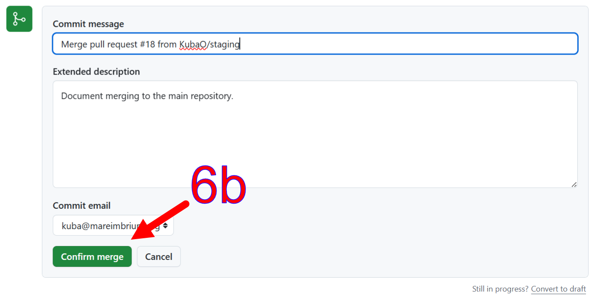
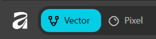
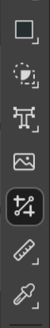

# 构建与部署

编辑文档的日常工作流程：需求、构建、本地服务、链接检查、Mermaid 图表、截图以及部署到 [docs.twinbasic.com](https://docs.twinbasic.com)。面向内容贡献者 --- 如果你正在修改构建管线本身，请参阅 [tbdocs 内部机制](/official/Documentation/Builder)。

## 开发环境

文档由 `tbdocs` 渲染为 HTML，这是一个自定义的 Node.js 静态站点生成器，位于 [`builder/`](https://github.com/twinbasic/documentation/tree/main/builder) 下。下面的日常命令是封装该生成器的 Windows 批处理文件；其 POSIX 等效版本列在旁边。

1. 确保满足下面的[需求](#requirements)。

2. 如果你计划进行任何更改，请将 [https://github.com/twinbasic/documentation][docs-repo] 分叉到你自己的 GitHub 账户，或为了方便起见分叉。如果你只想在本地构建文档而不贡献更改，则跳过此步。

3. 克隆你的分叉或[文档仓库本身][docs-repo]。

### 需求

- **Node.js 22+** 用于 `tbdocs` 本身。站点离线构建，无需 Ruby 工具链。
- **`npm ci`** 在仓库根目录安装所有内容：静态站点生成器的依赖、PDF 渲染器的依赖和 `puppeteer`（由 PDF 渲染器和 mermaid 的 `.mmd` → `.svg` 重新生成器共用）。仓库根目录的一个 `package.json` 承载整个依赖集。`build.bat` / `serve.bat` 封装脚本假定安装已经运行。
- **Chromium** 在需要重新生成 `.mmd` 图表和渲染 PDF 书籍时是必需的。通过 `npx puppeteer browsers install chrome --install-deps` 一次性下载。构建期间缺少 Chromium 会降级为警告并复用磁盘上的 `.svg`，因此跳过安装步骤的首次设置仍然可以构建（只是没有图表更新）。

## 构建

将文档从 `.md` 文件渲染到 `_site/`（在线）、`_site-offline/`（离线镜像）和 `_site-pdf/`（稀疏 PDF 源）文件夹：

    build.bat

或直接运行：

    node builder\tbdocs.mjs --src docs

单次 `tbdocs` 运行生成全部三棵树。`_config.yml` 中的 `also_build_offline` 和 `also_build_pdf` 键切换同级输出；`--no-offline` 和 `--no-pdf` 标志在命令行上做同样的事情，如果你只需要 `_site/`。

`tbdocs` CLI 标志的完整集合 --- 每个标志、其作用、何时使用 --- 位于[工具与脚本](/official/Documentation/Tools#tbdocs)页面。

## 构建与本地服务

最简单的本地预览是运行 `build.bat` 然后在任意浏览器中打开渲染的文件。要使用本地主机服务器：

    serve.bat

这运行 `tbdocs --serve`：初始构建后，HTTP 服务器绑定到端口 4000（传入 `--port <N>` 使用不同端口），递归源树监视器在每次文件更改时触发防抖重建，任何打开该页面的浏览器标签页在每次成功重建后通过 SSE 自动重新加载。只记录失败（4xx、5xx、服务器异常）--- 成功的请求是无声的。Ctrl+C 干净退出。

Serve 写入 `docs/_serve/`，与 `build.bat` 的 `_site/` 系列完全分离。这种分离意味着一次性 `build.bat` 调用（例如，为 `book.bat` 刷新 `_site-pdf/`，或重新检查 `_site-offline/` 的链接完整性）永远不会触及实时预览正在服务的树，预览始终显示 serve 上次重建的内容。

## 检查链接完整性

在检查链接完整性之前，必须先构建文档：

    check.bat

这运行两轮 `scripts/check_links.mjs`：一轮针对 `_site/`（在线树），一轮针对 `_site-offline/`（`file://` 可浏览的镜像），使用 `--forbid 'https://docs.twinbasic.com'` 同时标记任何残留的在线站点链接 --- 离线镜像不应导航回在线文档站点。两项检查还断言 HTML 格式良好性、重复 `id` 检测、锚点解析、可访问性提示以及（对于在线树）站点地图和搜索索引完整性。相同的两项检查在 CI 中每个拉取请求和每次推送到 `staging` 时运行。

干净的 `check.bat` 运行是"准备好提交"的标准。

## Mermaid 图表

Mermaid 图表以 `.mmd` 源文件形式存放在 `docs/assets/images/mmd/` 下，并在 markdown 中以 `.svg` 引用：

    

`tbdocs` 在 SVG 缺失或比其源文件更旧时，从 `.mmd` 同级文件重新生成每个 `.svg` --- 编辑 `.mmd` 一个字符后下次构建即重新生成 SVG。两个文件都属于 git；`.mmd` 是规范源，`.svg` 是浏览器实际加载的构建产物。

渲染器直接驱动 `puppeteer` + `mermaid` 包（两者都是仓库根 `package.json` 中的常规依赖）。一个无头 Chromium 覆盖整个批次 --- 以前项目通过 shell 调用 `@mermaid-js/mermaid-cli`，这会为每个图表分叉一个新的 node + Chrome 进程并附带自己捆绑的 puppeteer-core。直接路径使依赖树更小，消除了每文件进程启动开销，并使用与 `render-book.mjs` 相同的 Chromium 缓存。两种失败模式有不同的处理：

- **设置失败**（无 puppeteer、无 Chrome、无 mermaid）发出一行警告，保留磁盘上现有的 SVG，并让构建以退出码 0 退出 --- 没有 `npm install` 的新签出或没有 Chromium 的沙箱不会中断无关工作。
- **内容失败**（损坏的 `.mmd` 语法、渲染异常）逐字发出解析器错误，保留该图表之前的 SVG，继续渲染批次的其余部分，并设置 `process.exitCode = 1` 以便 CI 捕获损坏的图表。

在 serve 模式下，监视器忽略对 `assets/images/mmd/*.svg` 的写入。`.mmd` 是事实来源；`.svg` 是 mermaid 回写到 `srcRoot` 下的构建产物。没有此过滤器，每次 `.mmd` 编辑会触发两次重建（一次在编辑时，一次在 SVG 写入时），浏览器为一次用户更改重载两次。

## 部署到 docs.twinbasic.com

1. 将你的更改推送到你的 GitHub 分叉的[文档仓库][docs-repo]。

2. [在文档仓库中开一个新的拉取请求][docs-pr]。

3. 点击**跨分叉比较**。

4. 选择你的仓库和要合并的分支。

   

5. 创建拉取请求。

   

   维护者会将拉取请求合并到文档仓库。你可能希望在 [#docs][hash-docs] 频道上提及待处理的请求，尽管 [#github-docs][hash-github-docs] 频道提供拉取请求的自动通知。通常，维护者会通过 Discord 收到新拉取请求的通知，并会合并它或评论要求修改。

   **以下步骤由维护者完成。**

6. 审查，然后合并拉取请求或评论要求修改。

   

   

7. 选择 **Build & deploy docs** 操作。
   {width="75%"}

8. 如果需要发布快照，手动运行构建和部署工作流。（推送到 `staging` 会自动部署到 Pages；只有手动运行会额外创建一个 GitHub Release，附带离线可浏览站点副本的 zip 和 PDF 书籍附件。）
   {width="50%"}

## 编辑截图

编辑截图的一种方式是使用集成矢量/像素程序，如 [Affinity][af]1。可能的工作流程：

1. <kbd>PrtSc</kbd> 截取屏幕截图。

2. 在 Affinity 中，<kbd>Ctrl-Alt-Shift-N</kbd>（文件，从剪贴板新建）将整个截图导入程序。

3. 使用矢量裁剪工具（来自 Vector 工作室）将截图裁剪到相关部分。

    

4. 选择裁剪后的图像并用 <kbd>Ctrl-C</kbd> 复制到剪贴板。

5. 再次从剪贴板创建新文件，打开仅包含裁剪截图的文档 <kbd>Ctrl-Alt-Shift-N</kbd>（文件，从剪贴板新建）。

6. 关闭在第 2 步中打开的文件。

7. 根据需要添加箭头和标签。这些可以从本仓库中其他 `.af` 文件复制粘贴。

8. 通过 <kbd>Ctrl-Alt-Shift-W</kbd>（文件，导出，导出...）导出为 PNG。

::: info
约定是将 `.af`（"源"）文件放在 `_Images` 文件夹中，导出的 `.png` 文件放在 `Images` 文件夹中。只有后者发布到网站。前者作为源保留，以便于编辑和更新。
:::

---

1 Affinity 是一个免费套件，集成了矢量编辑器、位图编辑器和排版布局编辑器。需要 Canva 账户才能下载；账户是免费的。

[af]: https://www.affinity.studio/download
[docs-pr]: https://github.com/twinbasic/documentation/compare
[docs-repo]: https://github.com/twinbasic/documentation
[hash-docs]: https://discord.com/channels/927638153546829845/1021635324809596988
[hash-github-docs]: https://discord.com/channels/927638153546829845/1111554338221989908

> AI生成