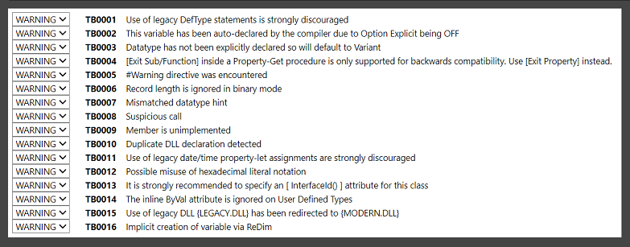

# 编译器警告
twinBASIC 在设计时为常见的坏习惯或可能的疏忽提供编译器警告。

## 可用警告

### 可能不正确的十六进制字面量警告

非显式值首先被强制转换为最低可能的类型。因此，如果您将常量声明为 `&H8000`，编译器将其视为 -32,768 的 `Integer`，而当您将这个值放入 `Long` 时，您几乎肯定不想要 -32,768，而是想要**正数** 32,768，这需要您改用 `&H8000&`。

此警告适用于 `&H8000`-`&HFFFF` 和 `&H80000000`-`&HFFFFFFFF`。

### 使用 ReDim 隐式创建变量的警告

当您使用 `ReDim myArray(1)` 时，`myArray` 变量会为您创建，但最佳实践是首先声明所有变量。

### 使用 DefType 的警告

不鼓励使用此功能，因为它使代码难以阅读，容易出现难以调试的错误。

完整列表可以在您的项目设置页面找到：



## 调整警告

每个警告都可以设置为忽略或通过设置页面将其转换为错误（项目范围内），以及通过 `[IgnoreWarnings(TB___)]`、`[EnforceWarnings(TB____)]` 和 `[EnforceErrors(TB____)]` 属性在每个模块/类、每个过程中设置，其中下划线被**完整**数字替换，例如 `[IgnoreWarnings(TB0001)]`；必须包含前导零。

## 严格模式
twinBASIC 添加了以下警告消息来支持类似于 .NET 的严格模式的功能，其中某些隐式转换不被允许，必须显式进行。默认情况下，这些都设置为忽略，并且必须在项目设置的"编译器警告"部分或每个模块/过程中使用 `[EnforceWarnings()]` 启用。所有这些都可以单独配置，并可以使用 `[IgnoreWarnings()]` 在过程/模块范围内忽略。

### TB0018：隐式窄化转换

例如将 Long 转换为 Integer；如果您有 `Dim i As Integer, l As Long`，那么 `i = l` 将触发警告，而 `i = CInt(l)` 是避免它的必要条件。

### TB0019：隐式枚举转换

当将一个枚举的成员分配给另一个类型的变量时，例如 `Dim day As VbDayOfWeek: day = vbBlack`。指针中使用的 `CType(Of <type>)` 操作符（在前面部分描述）也用于在这种情况下指定显式类型转换；`day = CType(Of VbDayOfWeek)(vbBlack)` 不会触发警告。

### TB0020：可疑接口转换

如果声明的 coclass 没有显式命名支持的接口，转换到它将触发此警告，例如：

```vb
Dim myPic As StdPicture
Dim myFont As StdFont
Set myFont = myPic
```

您可以使用 `Set myFont = CType(OfStdFont)(myPic)` 来避免此警告。

### TB0021：枚举与数值之间的隐式转换

通过将数值字面量分配给枚举类型的变量触发，例如 `Dim day As VbDayOfWeek: day = 1`。要避免它，您可以使用 `day = CType(Of VbDayOfWeek)(1)`。