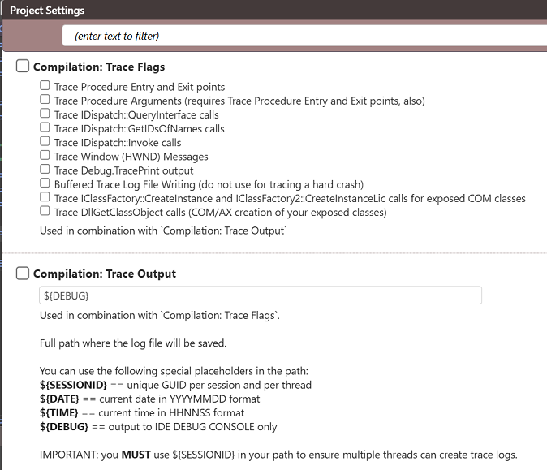
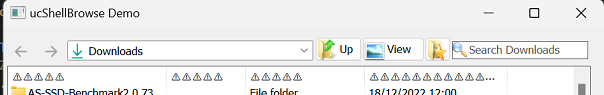

# 调试功能

twinBASIC 包含多项有助于调试的功能。

## 调试跟踪记录器

调试体验的新功能是跟踪日志功能，可自动创建详细日志到调试控制台或文件。消息可以通过 `Debug.TracePrint` 输出。记录器在从 IDE 运行和编译的可执行文件中都可以工作。



```vb
Public Sub ProcessOrder(ByVal orderId As Long)
    Debug.TracePrint "ProcessOrder called, orderId=" & CStr(orderId)
    ' ... processing ...
End Sub
```

## 过期/悬挂指针检测

使用已释放的 String 和 Variant 会导致 bug。如果内存尚未被覆盖，可能不会立即注意到，但有时很难检测，可能引起诸如 String 显示其先前值或乱码之类的问题。此调试选项检测释放后使用，并将数据替换为特殊符号以指示问题。

下图展示了一个示例，其中 ListView ColumnHeader 文本被已释放的字符串设置并被此功能检测到：



以前，它在每个列中都显示相同的文本——但只在特定情况下出现，导致该问题长期被忽视。