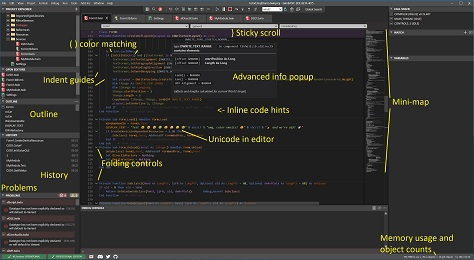
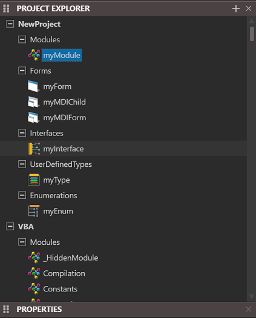
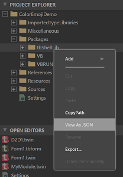
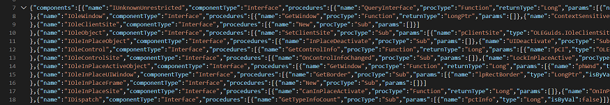

# 现代 IDE 功能

虽然 twinBASIC IDE 仍有许多计划中的工作，但它已经包含许多在其他现代 IDE 中能找到而古老 VBx IDE 中没有的便利功能。

## 主题系统

完全支持主题自定义，内置暗色（默认）、亮色和经典（亮色）主题，并提供基于继承的简便系统，可通过 CSS 文件添加自定义主题。

## 代码导航和结构

- **代码折叠**，支持通过 `#Region "name" ... #End Region` 块定义可折叠的自定义区域。
- **粘性滚动**，在顶部保持上下文行，显示模块、区域、方法、`With` 块等主要代码段落。
- **缩进参考线**，沿常见缩进位置绘制线条帮助对齐。
- **代码缩略图**，在滚动条旁边显示代码结构的图形概览，辅助滚动定位。

## 编辑功能

- **完全可自定义的键盘快捷键**，涵盖所有命令，可保存和切换不同方案。
- **粘贴时自动缩进**。
- **粘贴为注释**。
- **内联代码提示**，在块末尾提供注释标注该块的类型（见图）。
- **括号和方括号颜色匹配**。

## 高级功能

- **完整 Unicode 支持**，在 .twin 文件中，你可以在注释和字符串中使用字体的完整 Unicode 范围。
- **高级信息弹窗**，显示 UDT 成员的偏移量、通过 `Len()` 和 `LenB()` 的总大小及其对齐方式；以及接口和类的 v-table 条目偏移量及其继承链。
- **类型库查看器**，用于控件和 TLB 文件，以 twinBASIC 风格的语法显示完整内容，而非 ODL。

## 面板和窗口

- **历史面板**，包含最近修改方法的列表。
- **大纲面板**，带有可选类别。
- **问题面板**，提供当前所有错误和警告的列表（可以筛选只显示其中一种）。

## 窗体设计器增强

在窗体设计器上，`Visible = False` 的控件会显示为半透明以直观指示。此外，按住 Control 键会显示每个 Tab Stop 的 Tab 键索引。

[完整大图](../Images/fafaloneIDEscreenshot1.png)

### 新的基于代码的项目资源管理器

新的基于代码结构的项目资源管理器：

经典的基于文件的视图仍然是默认使用的，你可以通过切换按钮激活新视图：

## 以 JSON 格式查看窗体和包

项目窗体和包以 JSON 格式数据存储，你可以在项目资源管理器中右键点击并选择"View as JSON"来查看。这对于包特别有用，因为它以更易解析的格式暴露了整个代码。

