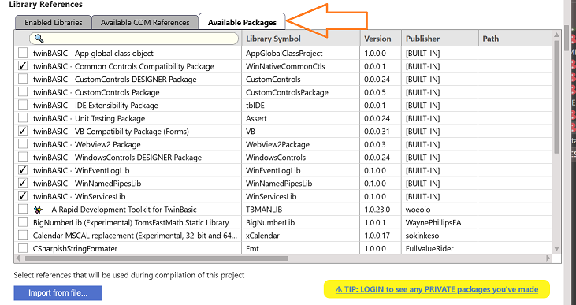

# Package Server

Code can be grouped as a package, and published to an online server. You can have Private packages, visible only to you, or Public packages, visible to everyone.

For more information, see the following pages:

- [What is a package](/official/Features/Packages/)
- [Creating a TWINPACK package](/official/Features/Packages/Creating-a-TWINPACK-package)
- [Importing a package from a TWINPACK file](/official/Features/Packages/Importing-a-package-from-a-TWINPACK-file)
- [Importing a package from TWINSERV](/official/Features/Packages/Importing-a-package-from-TWINSERV)
- [Updating a package](/official/Features/Packages/Updating-a-package)
