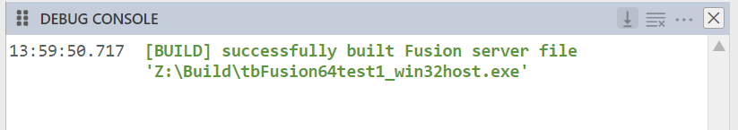
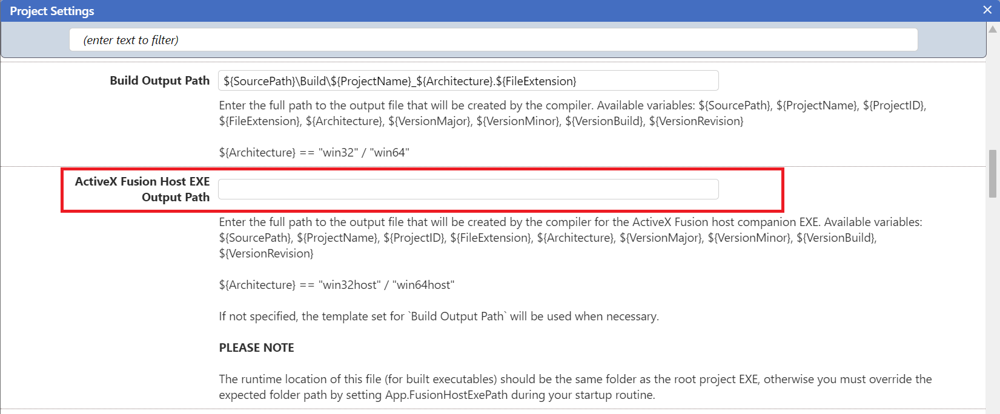
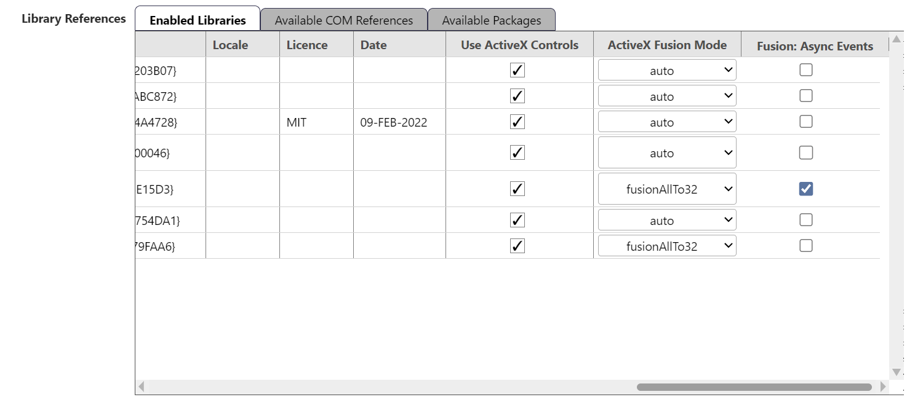

## 简介

**Fusion** 是 twinBASIC 的一项功能，使 64 位应用程序能够托管某些 32 位 ActiveX 控件，通过透明地将它们桥接到一个外部进程辅助可执行文件中。

传统上，ActiveX 控件的位数必须与宿主应用程序匹配。这一限制长期以来阻碍了在现代 64 位应用程序中使用遗留 32 位控件。Fusion 通过引入一个桥接层来消除此限制，允许跨架构交互。

请注意：此技术目前仅在 Windows 10 和 11 机器上经过测试。在较旧的操作系统上可能会有不同表现。

## "外部进程"是什么意思？

**外部进程**组件运行在单独的可执行文件（进程）中，而不是在主应用程序的同一内存空间内。

使用 *twinBASIC Fusion* 时：

- 你的主 twinBASIC 应用程序照常运行（例如 64 位）
- 一个辅助的**宿主 EXE** 会自动启动（例如 32 位）
- ActiveX 控件在此辅助进程中创建和托管
- 主应用程序与控件之间的通信由 twinBASIC 透明处理

这种分离允许不兼容的架构（例如 64 位应用中的 32 位控件）安全地互操作。

## 进程间通信 (IPC)

由于 *twinBASIC Fusion* 跨两个独立进程运行，应用程序与托管的 ActiveX 控件之间的所有交互都通过**进程间通信 (IPC)** 进行。

简单来说，IPC 是一种允许两个独立进程交换数据和调用行为的机制。

使用 *twinBASIC Fusion* 时：

- 方法和属性调用**通过 IPC 层封送**到宿主 EXE
- 宿主 EXE 对真实的 ActiveX 控件实例执行调用
- 返回值传回调用进程

事件以相反的方式遵循相同的模式：

- 控件在宿主 EXE 中触发事件
- 事件通过 IPC 通道传回
- 你的应用程序接收到它，就像它是在本地产生的一样

#### 重要特征：

- 由于跨进程通信，存在少量固有开销
- 所有参数和返回值必须被序列化/反序列化
- 执行对你的代码表现为同步的，但实际上在远程执行

## 死锁和冻结

由于跨进程通信和消息泵的性质，使用 Fusion 的某些控件可能会出现**死锁或 UI 冻结**。

如果遇到此问题，可以尝试启用以下每个库的选项：

**Fusion: 异步事件**

这会改变事件在 IPC 边界的传递方式，可以帮助某些控件避免重入和阻塞问题。

## 自动生成 Fusion 宿主 EXE

当你打开 twinBASIC 项目时，编译器会评估所有引用的 ActiveX 控件是否可用于当前架构并已注册。

如果有一个或多个控件未为当前架构注册，twinBASIC 将在需要时自动在项目旁边生成一个 **Fusion 宿主 EXE**。

发生这种情况时，你会在调试控制台中看到一条提示：

{style="width:412px; height:73px;"}

这个额外的 EXE 充当这些控件的外部进程容器，由 twinBASIC IDE 自动管理。

## ActiveX 宿主 EXE 输出路径

项目级设置允许你控制 Fusion 宿主 EXE 的生成位置：

- **ActiveX Fusion 宿主 EXE 输出路径**

{style="width:800px; height:400px;"}

如果留空（默认），则使用项目设置中的标准构建路径。除非被覆盖，标准构建路径为：
${SourcePath}\Build${ProjectName}_${Architecture}.${FileExtension}

对于 Fusion 宿主可执行文件，`${Architecture}` 将解析为：
- `win32host`
- `win64host`

这使得 Fusion 宿主 EXE 可以与正常构建输出明确区分。

## 每个库的选项

每个 COM 引用（类型库）都公开 Fusion 专用选项。

{style="width:737px; height:323px;"}

### ActiveX Fusion 模式

控制如何（以及是否）对给定库应用 Fusion。

**可用选项：**

- `auto`（默认）

  仅当库在当前架构下不可用时自动启用 Fusion
  - 64 位构建中的 32 位控件 → 使用 `fusion64To32`
  - 32 位构建中的 64 位控件 → 使用 `fusion32To64`

- `fusion32To64`
  - 32 位构建：生成并使用 **64 位宿主 EXE**
  - 64 位构建：不使用 Fusion

- `fusion64To32`
  - 64 位构建：生成并使用 **32 位宿主 EXE**
  - 32 位构建：不使用 Fusion

- `fusionAllTo64`
  - 32 位和 64 位构建都使用 **64 位宿主 EXE**
  此选项允许你在两种架构上都将这些控件作为外部进程 Fusion 控件运行。

- `fusionAllTo32`
  - 32 位和 64 位构建都使用 **32 位宿主 EXE**
  此选项允许你在两种架构上都将这些控件作为外部进程 Fusion 控件运行。

- `none`
  - 完全禁用此库的 Fusion

请注意：你不能在多个库之间混用显式的"Fusion 模式"设置（'auto' 和 'none' 模式除外，它们始终可以使用）。

### Fusion: 异步事件

布尔选项，默认关闭。
启用后，在 IPC 边界启用异步事件传递（从宿主 EXE 到主应用程序）。这可以帮助防止某些控件出现死锁或冻结。

::: info
使用此选项意味着你不能通过 ByRef 参数向托管控件返回数据（例如 `ByRef Cancel As Boolean` 参数将无效）。
:::

## 运行时行为和部署

对于编译构建的运行时：

- 主应用程序将在**与主可执行文件相同的目录**中查找 Fusion 宿主 EXE
- 文件名必须与构建时生成的文件名匹配

如果需要，你可以覆盖此行为：

```vb
App.FusionHostEXEPath = "C:\Path\To\Host.exe"
```

### 重要提示：

此显式路径必须在打开任何基于 Fusion 的窗体或控件**之前**设置。Fusion 宿主 EXE 必须始终随你的应用程序一起分发。未包含宿主 EXE 将导致基于 Fusion 的控件无法加载，主应用程序进程将终止。

## 当前限制

Fusion 是一个兼容层，但并非所有 ActiveX 控件都受支持。

#### 目前不支持：
- 无窗口控件
- 容器控件
- 依赖其他驻留控件的控件

#### 其他已知限制：
- 控件之间无 Tab 键导航
- 属性页尚未实现
- 不支持的属性
- ToolTipText
- CausesValidation
- DragMode
- DragIcon
- HelpContextID
- WhatsThisHelpID
- TabStop
- TabIndex

## 事件差异

鼠标事件目前不进行 OLE 转换，因此鼠标事件签名（MouseDown、MouseUp、MouseMove）将与传统的 ActiveX 预期不同。这是当前的限制，将在后续更新中修复。

## 总结

*twinBASIC Fusion* 为在现代化应用程序的同时保留与遗留 ActiveX 控件的兼容性提供了一条实用路径。

通过使用外部进程架构和基于 IPC 的快速通信，*twinBASIC Fusion* 实现了跨位数互操作，同时保持了熟悉的编程模型。