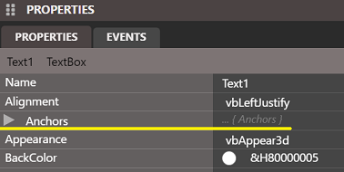
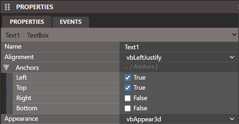
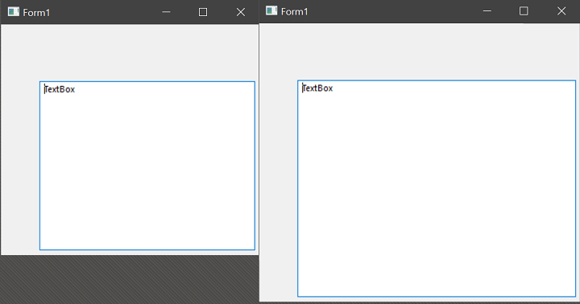
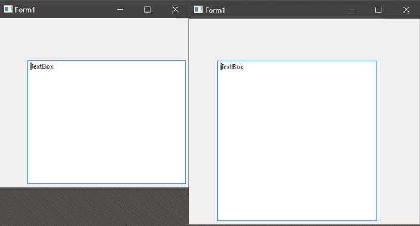
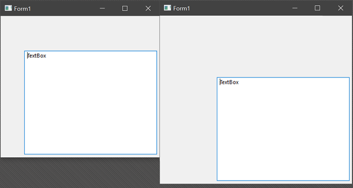
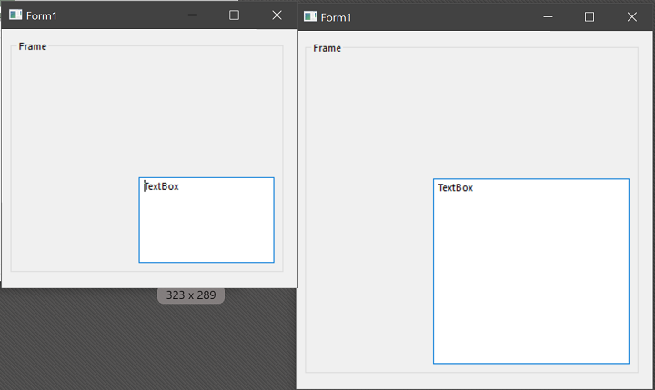
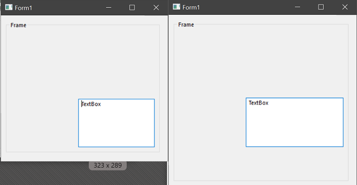
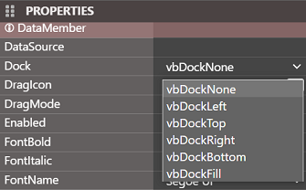
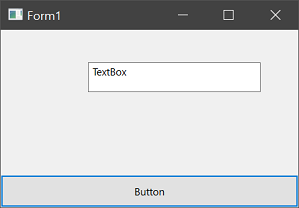
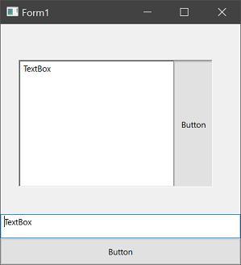

# 锚定

twinBASIC 窗体设计器中新增的功能之一是 'Anchors' 属性：

点击左侧箭头展开后提供 4 个选项：

这些选项控制每个点相对于父窗体或控件容器的边框的位置在窗体大小改变时是否保持不变。默认行为是符合预期的；上边和左边保持不变，除非你通过代码手动处理（通常在 `Form_Resize` 事件中），否则控件不会随窗体调整大小或移动。锚定提供了自动处理大小和位置调整的替代方案。

如果控件在四个位置都锚定，它将在两个维度上随窗体调整大小：

如你所见，所有锚点都保持与边缘的恒定距离，结果控件被调整了大小。如果只锚定上、左和下，它将只在垂直方向调整大小，不在水平方向调整：

右边未锚定到边缘，所以它没有随边缘移动。

如果你取消上边和左边的锚定（False）但保持右边和下边的锚定（True），控件将随下边和右边移动：

控件保持相同大小，因为右边和下边锚定到边缘，它们随窗体移动，结果整个控件被移动了。

### 控件容器

以上示例说明了直接在窗体上的控件如何工作。但如果控件在 Frame 或其他控件容器中呢？锚点是相对于其父容器的，因此调整窗体大小不会调整或移动 Frame 内部的控件，除非 Frame 也以改变其大小/位置的方式锚定。

例如，如果一个 TextBox 在四个点都锚定，且位于一个在四个点都锚定的 Frame 中，那么它将随 Frame 调整大小：

如果我们移除 TextBox 的底部锚定但保留 Frame 的底部锚定，Frame 将沿底部调整大小，但 TextBox 不会：

使用这 4 个点，你可以自动维持相对大小、位置或两者兼有，而无需手动编写任何代码。

::: tip
提醒一下，twinBASIC 还为窗体添加了 `MinWidth`、`MinHeight`、`MaxWidth` 和 `MaxHeight` 属性，因此可以与控件锚定结合使用来自动管理。你可能希望设置一个最小尺寸，以免控件消失。
:::

# 停靠

与锚定类似但略有不同，tB 还提供了 'Dock' 属性：

你可能已经熟悉 StatusBar 控件如何将自己锁定到窗体底部；这就是此属性控制的定位类型。控件可以停靠在任何一边，并保持该边的完整宽度或高度，随窗体或父容器的该边移动。例如，具有 `vbDockBottom` 的 CommandButton：

除了四个边之外，还有一个最终选项：`vbDockFill`。这将使控件填充其整个父区域。这在使用 PictureBox 或 Frame 等容器控件时最有用——当它作为子控件时，只填充该容器，而不是整个窗体。

`vbDockFill` 会排除其他停靠控件，因此例如你可以有一个 `vbDockRight` 的控件和另一个 `vbDockFill` 的控件，后者覆盖窗体或容器的其余部分，而第一个控件保持在右侧的位置。

### 多个控件

正如上一节末尾所暗示的，可以将多个控件停靠到同一位置，例如将 CommandButton 和 TextBox 停靠到底部。以下示例还展示了具有 `vbDockRight` + `vbDockFill` 的 PictureBox 控件：

::: tip
停靠在同一位置的两个（或多个）控件的顺序由设置先后决定。目前不能拖动重新排列，但你可以将 Dock 属性设回 none，然后按所需顺序重新设置。
:::