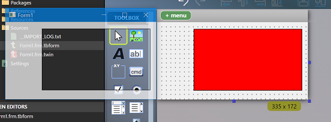

# 窗体功能

twinBASIC 为窗体和窗体处理提供了大量增强。

## 现代图像格式支持

你不再面对 tB 窗体和控件中极其有限的图像格式选择；不仅 Bitmap 和 Icon 格式支持其全部格式范围，你还可以加载 PNG 图像、JPEG 图像、Metafile（.emf/.wmf）和 SVG 矢量图形（.svg）。

### 增强的 LoadPicture

此外，`LoadPicture` 可以直接从字节数组加载所有图像类型，而无需磁盘上的文件。你可以使用此功能从资源文件或其他来源加载图像。注意，如果你的项目引用了 stdole2.tlb（大多数都是），目前你必须限定为 `Global.LoadPicture` 以获取支持字节数组的 tB 自定义绑定。

## 透明度和 Alpha 混合

### Form.TransparencyKey

这个新属性指定一种颜色，该颜色对 z 序中其下方窗口（所有窗口，不只是你的项目中的）完全透明。设置此属性将使指定颜色变为 100% 透明。使用具有实心 `FillStyle` 的 Shape 控件是将窗体区域着色为透明色的有用工具。

### Form.Opacity

这为整个窗体设置 Alpha 混合级别。与透明度一样，这是对紧邻其下方的所有窗口。注意，被 `TransparencyKey` 颜色覆盖的任何区域将保持 100% 透明。

下图展示了一个具有红色 `TransparencyKey` 的窗体，使用 Shape 控件定义透明区域，同时为整个窗体指定了 75% 的 `Opacity`：

## 附加窗体功能

除了上述之外，窗体还有：

- `DpiScaleX`/`DpiScaleY` 属性用于获取当前值
- `.MinWidth`、`.MinHeight`、`.MaxWidth` 和 `.MaxHeight` 属性，无需子类化即可实现
- `Form.TopMost` 属性
- 控件锚定：控件的 x/y/cx/cy 可以设为相对值，因此它们会随窗体自动移动/调整大小。例如，如果你将 TextBox 放在右下角，然后勾选右边和下边的锚定（除了上边和左边），右下角会随窗体调整大小。这节省了大量样板式的大小调整代码。
- 控件停靠：控件可以固定在窗体（或容器）的任一边，或填充整个窗体/容器。多个控件可以在停靠位置上进行组合和混搭。

有关控件锚定和控件停靠的更多信息，请参见[锚定和停靠页面](/official/Features/GUI-Components/Anchoring-Docking)。

## 图像控件中的高质量缩放

图像控件现在提供 `StretchMode` 属性，允许你选择 Bilinear、Bicubic、Lanczos3 和 Lanczos8 拉伸算法，这些远优于默认拉伸算法。它们使用内置算法，不会增加额外的依赖或 API 调用。

## DPI 缩放

窗体、UserControl 和 PictureBox 的 PictureDpiScaling 属性：PictureDpiScaling 属性允许你关闭图像的 DPI 缩放，使其以 1:1 显示而非让操作系统拉伸它们。这样做的想法是你可能希望手动选择不同的位图，而不是应用 somewhat 有限的操作系统拉伸。