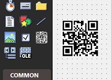
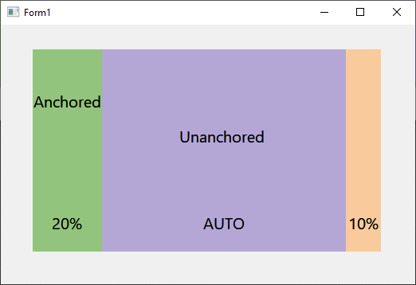
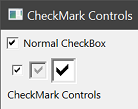

# 新控件

twinBASIC 引入了几种新控件来增强你的应用程序。

## QR Code 控件

使用原生控件轻松显示自定义 QR 码。

## Multiframe 控件

此控件允许你创建多个帧，其大小以百分比指定，这样当控件调整大小时，帧内的内容按比例扩展。有关详细信息和视频演示，Mike Wolfe 的 twinBASIC 周更新在[发布时做了介绍](https://nolongerset.com/twinbasic-update-april-29-2025/#experimental-multi-frame-control)。

结合锚定和停靠，这允许设计高度功能化和复杂的布局，无需编写任何处理大小调整的代码。

## CheckMark 控件

主要面向报表但在窗体和 UserControl 中也可用，CheckMark 控件提供了可缩放的勾选组件，而普通 CheckBox 控件中此组件固定为单一尺寸。