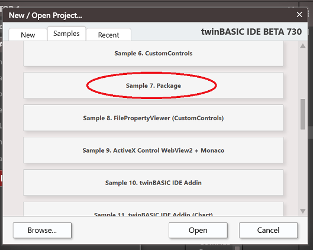
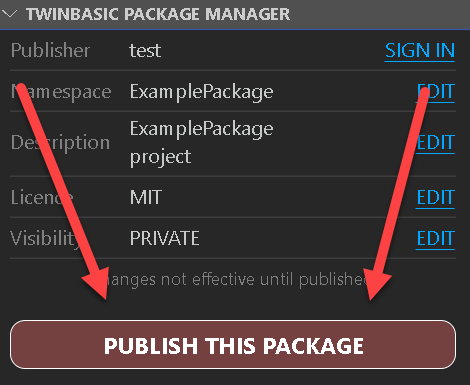
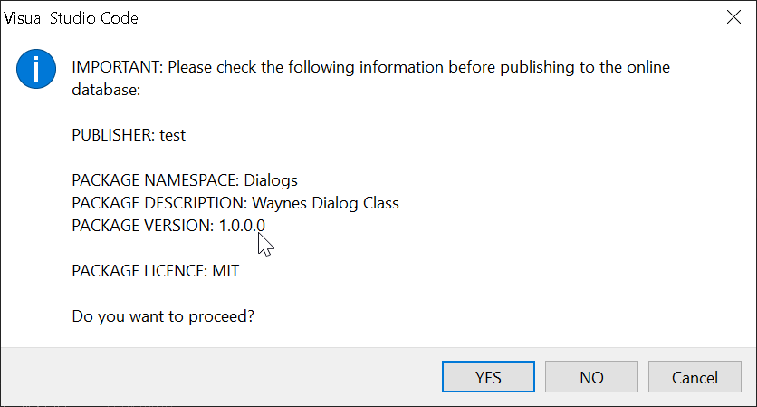
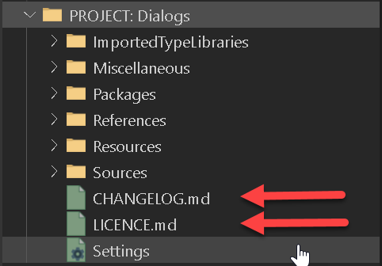

# 创建 TWINPACK 包

要创建新的 TWINPACK 包，请导航到 twinBASIC 新建项目对话框，在"Samples"选项卡下选择标记为"Package"的选项：

 
 

创建项目后，你应该会看到一个额外的"PACKAGE PUBLISHING"面板弹出：

 
 

你现在应该通过包管理器的"EDIT"链接适当地编辑命名空间、描述、许可证和可见性属性，这将带你到 `Settings` 文件中的各个设置。编辑完成后，记得关闭（并保存）`Settings` 文件，以便更改反映在包管理器面板中。

- **命名空间：** 这是在引用你的包的项目中用于分组组件的符号。例如，提供一系列不同对话框类的包可能使用命名空间 `Dialogs`。
- **描述：** 这是将出现在 `Settings`->`References` 列表中的描述文本。如果你计划分享此包，请仔细考虑描述，以便他人可以通过 TWINSERV 发现你的包。
- **许可证：** 此短文本出现在 `Settings`->`References` 列表中，与描述一起显示。如果你计划分享此包，填写此字段很重要，输入的值应与 LICENCE.md 文件的内容适当匹配（例如 'MIT'、'LGPL' 等）。
- **可见性：** 决定包是仅你可见（PRIVATE）还是所有人可见（PUBLIC）。此处的值仅在使用"PUBLISH THIS PACKAGE"按钮将包发布到包管理器服务 TWINSERV 时生效。

*如果你不打算在 TWINSERV 上发布包，则无需填写**许可证**或**可见性**字段。*

你现在可以像平常一样在项目中创建组件（Class、Module、Interface），完成后，是时候完成包的构建了。你有两个选项；

 

## 选项 1 - 将包构建为 TWINPACK 文件

如果你想只创建一个可以在其他项目中使用的本地 TWINPACK 文件，请使用此选项。为此，构建过程与任何普通 twinBASIC 构建相同……只需点击 TWINBASIC 工具栏中的构建按钮：

 
 

你将在 `DEBUG CONSOLE` 中看到构建输出通知，如上所示。

大功告成。参见[从 TWINPACK 文件导入包](/official/Features/Packages/Importing-a-package-from-a-TWINPACK-file)了解如何在其他 twinBASIC 项目中引用和使用 TWINPACK 文件。

 

## 选项 2 - 直接将包发布到包管理器服务 (TWINSERV)

如果你要将包发布到 TWINSERV，无需手动创建 TWINPACK 文件。只需使用"PUBLISH THIS PACKAGE"按钮：

{style="width:45%; height:auto;"}
 
 

***将包发布到 TWINSERV 需要先创建发布者账户。如果尚未创建，你会在此时被提示创建。***

然后你将被提示确认包详细信息：

{style="width:65%; height:auto;"}
 
 

按 `YES` 后，包将被上传到 TWINSERV。检查 `DEBUG CONSOLE` 获取完成通知：

{style="width:85%; height:auto;"}

 
 

如果包成功上传，它应该在几分钟后就可以通过 TWINSERV 使用。如果你创建了 `PUBLIC` 包，其他人此时将能够看到并下载它。

参见[从 TWINSERV 导入包](/official/Features/Packages/Importing-a-package-from-TWINSERV)了解如何引用和使用已上传的包。

 
 

## 特殊文件 LICENCE.md 和 CHANGELOG.md

创建新包项目时，你会在项目文件系统中看到为你创建的两个额外文件：

{style="width:55%; height:auto;"}
 
 

如果你要将 `PUBLIC` 包发布到包管理器服务，在发布前编辑这两个文件很重要。它们都是 markdown 文件，将来会变得更容易被考虑从 TWINSERV 使用你包的用户访问。