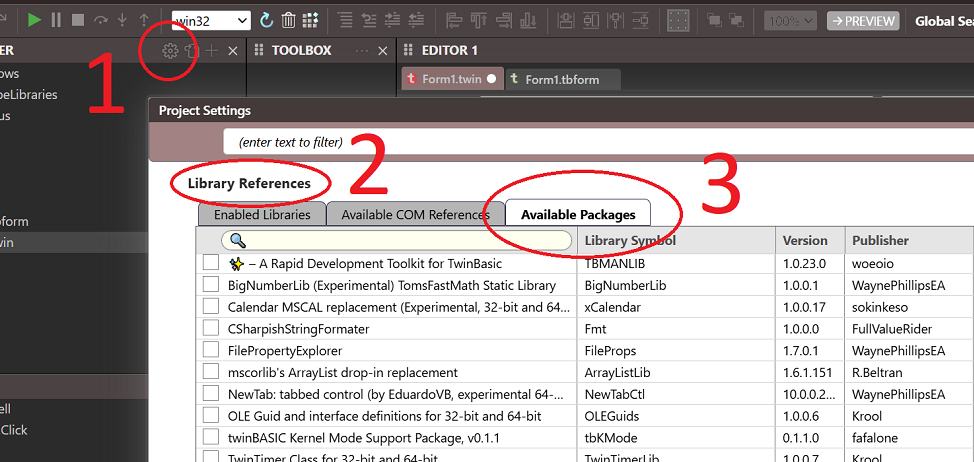
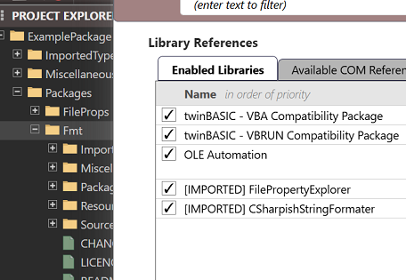
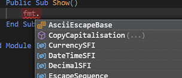

# 从 TWINSERV 导入包

打开要使用包的项目，打开其中的 `Settings` 文件并导航到 References 部分。选择"Available Packages"按钮，服务器上的所有包应该都会显示：

 
 

如果你勾选一个可用的包，它将被下载并导入到项目中：

 
 

完成后，保存并关闭 Settings 文件，这将导致编译器重启。现在你可以使用该包了！在上面的示例中，我添加了对 CSharpishStringFormater 包的引用，现在我可以确认可以在代码中访问该包的组件：

 
 

注意：如果你有已发布的任何 PRIVATE 包，它们仅在登录后可用。如果你尚未登录，你会看到一个警告链接，点击即可登录：

 
 

登录后，再次按"Available"按钮刷新列表。