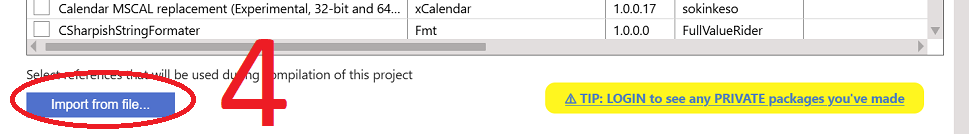

# 从 TWINPACK 文件导入包

要直接从 TWINPACK 文件（而非通过 TWINSERV）导入包，请按照以下步骤操作。

- 打开要使用包的项目
- 打开其中的 `Settings` 文件
- 导航到 References 部分
- 选择"Available Packages"按钮

- 按"Import from file..."按钮：

- 选择要导入的 TWINPACK 文件，然后它应该出现在引用列表中（已勾选）：

- 保存 `Settings` 并在需要时重启编译器

 

现在你可以使用该包了！在上面的示例中，我添加了对 CSharpishStringFormater 包的引用，现在我可以确认可以在代码中访问该包的组件：

 
 