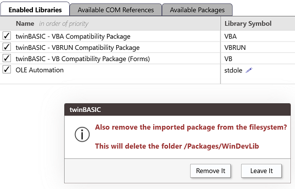

# 更新包

当加载项目时，编译器会通知你 TWINSERV 上是否有项目中的包的新版本可用：

如果你发现 TWINSERV 上有更新的包可用，必须先通过取消勾选来移除项目中的旧包。打开 Settings 到 References，取消勾选框。然后你将被提示从文件系统中移除它：

 
 
 

选择"Remove it"。

然后转到 Available Packages 选项卡，勾选最新版本的框，**等下载完成后**（可能需要几秒钟，因为有些包有数 MB），保存更改。在调试控制台中你会首先看到

`[PACKAGES] downloading package '{1FCDB98D-617D-4995-9736-2ED0E4746A10}/8/7/0/498' from the online database... `

然后当第二条消息

`[PACKAGES] downloading package '{1FCDB98D-617D-4995-9736-2ED0E4746A10}/8/7/0/498' from the online database... [DONE]`

出现时，表示完成并可以保存了。复选框也会从旋转状态变为条目移到顶部（在内置包下方），并在前面加上 `[IMPORTED]`。

如果保存后编译器没有自动重启，手动重启编译器，但通常会自动重启。

**注意：** 将来会有简单的更新选项。请留意该变化。