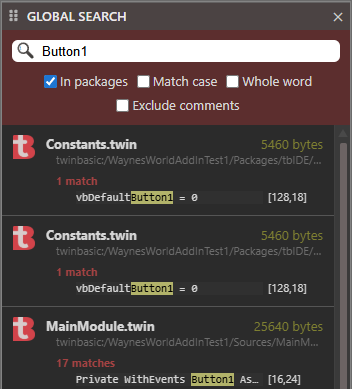

## 全局搜索

此外接程序随 twinBASIC IDE 附带。

最新版本
: v1.0.0.0

开发者
: twinBASIC

全局搜索外接程序将包含一个[工具栏](/official/IDE/Toolbar)项。

选项

- 在包中搜索
- 区分大小写
- 全字匹配
- 排除注释

在文本字段中输入搜索词（如 Button1），将返回匹配结果列表。

## 下载

此外接程序与 twinBASIC 捆绑在一起。可以从 [https://github.com/twinbasic/twinbasic/releases][tB] 下载。

[tB]: https://github.com/twinbasic/twinbasic/releases