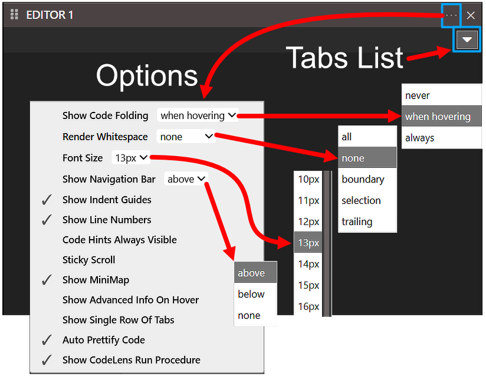
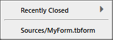

# 编辑器

## 选项

- 显示代码折叠
  - 从不
  - *悬停时*
  - 始终

- 渲染空白
  - 全部
  - *无*
  - 边界
  - 选择
  - 尾部

- 字体大小
  - 8px
  - ...
  - *13px*
  - ...
  - 30px
- 显示导航栏
  - 上方
  - 下方
  - 无
- ✔ 显示缩进指南
- ✔ 显示行号
- 代码提示始终可见
- 粘性滚动
- ✔ 显示小地图
- 悬停时显示高级信息
- 显示单行标签
- ✔ 自动美化代码
- ✔ 显示 CodeLens 运行过程

## 标签列表

当文件在_编辑器_中打开时，它将列在_标签列表_中，您可以在此处在它们之间跳转。

_最近关闭_。

_最近关闭 - 列表_

