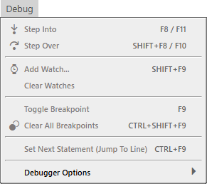

# 调试菜单

- 逐语句 <kbd>F8</kbd> / <kbd>F11</kbd>
- 逐过程 <kbd>SHIFT</kbd> + <kbd>F8</kbd> / <kbd>F10</kbd>
---
- 添加监视... <kbd>SHIFT</kbd> + <kbd>F9</kbd>
- 清除监视
---
- 切换断点 <kbd>F9</kbd>
- 清除所有断点 <kbd>CTRL</kbd> + <kbd>SHIFT</kbd> + <kbd>F9</kbd>
---
- 设置下一语句（跳转到行） <kbd>CTRL</kbd> + <kbd>F9</kbd>
---
- 调试器选项

## 调试器选项

- 遇到所有错误时中断
- ✔ 允许断点（可调试）

