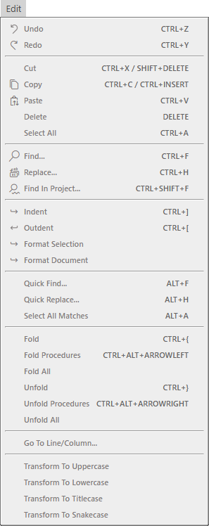

# 编辑菜单

- 撤销 <kbd>CTRL</kbd> + <kbd>Z</kbd>
- 重做 <kbd>CTRL</kbd> + <kbd>Y</kbd>
---
- 剪切 <kbd>CTRL</kbd> + <kbd>X</kbd> / <kbd>SHIFT</kbd> + <kbd>DELETE</kbd>
- 复制 <kbd>CTRL</kbd> + <kbd>C</kbd> / <kbd>CTRL</kbd> + <kbd>INSERT</kbd>
- 粘贴 <kbd>CTRL</kbd> + <kbd>V</kbd>
- 删除 <kbd>DELETE</kbd>
- 全选 <kbd>CTRL</kbd> + <kbd>A</kbd>
---
- 查找... <kbd>CTRL</kbd> + <kbd>F</kbd>
- 替换... <kbd>CTRL</kbd> + <kbd>H</kbd>
- 在项目中查找... <kbd>CTRL</kbd> + <kbd>SHIFT</kbd> + <kbd>Y</kbd>
---
- 缩进 <kbd>CTRL</kbd> + <kbd>]</kbd>
- 减少缩进 <kbd>CTRL</kbd> + <kbd>[</kbd>
- 格式化选定内容
- 格式化文档
---
- 快速查找... <kbd>ALT</kbd> + <kbd>F</kbd>
- 快速替换... <kbd>ALT</kbd> + <kbd>H</kbd>
- 全选匹配项 <kbd>ALT</kbd> + <kbd>A</kbd>
---
- 折叠 <kbd>CTRL</kbd> + <kbd>{</kbd>
- 折叠过程 <kbd>CTRL</kbd> + <kbd>ALT</kbd> + <kbd>ARROWLEFT</kbd>
- 全部折叠
- 展开 <kbd>CTRL</kbd> + <kbd>}</kbd>
- 展开过程 <kbd>CTRL</kbd> + <kbd>ALT</kbd> + <kbd>ARROWRIGHT</kbd>
- 全部展开
---
- 转到行/列...
---
- 转换为大写
- 转换为小写
- 转换为标题大小写
- 转换为蛇形命名