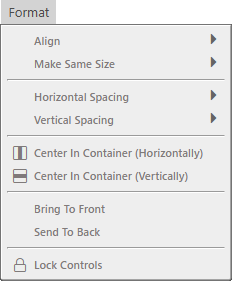
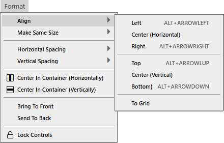
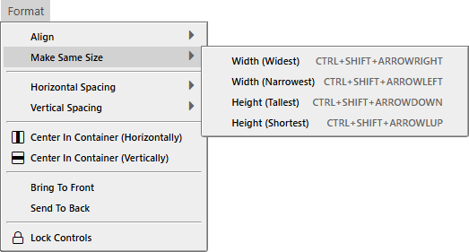
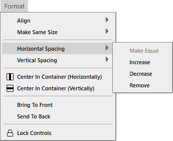

# 格式菜单

- 对齐
- 统一大小
---
- 水平间距
- 垂直间距
---
- 在容器中居中（水平）
- 在容器中居中（垂直）
---
- 置于顶层
- 置于底层
---
- 锁定控件

- 左对齐 <kbd>ALT</kbd> + <kbd>ARROWLEFT</kbd>
- 居中（水平）
- 右对齐 <kbd>ALT</kbd> + <kbd>ARROWRIGHT</kbd>
---
- 顶部对齐 <kbd>ALT</kbd> + <kbd>ARROWUP</kbd>
- 居中（垂直）
- 底部对齐 <kbd>ALT</kbd> + <kbd>ARROWDOWN</kbd>
---
- 对齐到网格

- 宽度（最宽） <kbd>CTRL</kbd> + <kbd>SHIFT</kbd> + <kbd>ARROWRIGHT</kbd>
- 宽度（最窄） <kbd>CTRL</kbd> + <kbd>SHIFT</kbd> + <kbd>ARROWLEFT</kbd>
- 高度（最高） <kbd>CTRL</kbd> + <kbd>SHIFT</kbd> + <kbd>ARROWDOWN</kbd>
- 高度（最矮） <kbd>CTRL</kbd> + <kbd>SHIFT</kbd> + <kbd>ARROWUP</kbd>

- 使相等
- 增加
- 减少
- 移除

- 使相等
- 增加
- 减少
- 移除