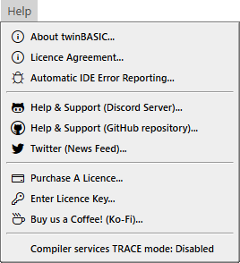

# 帮助菜单

- 关于 twinBASIC...
- 许可协议...
- 自动 IDE 错误报告...
---
- 帮助与支持（Discord 服务器）...
- 帮助与支持（GitHub 仓库）...
- Twitter（新闻动态）...
---
- 购买许可证...
- 输入许可证密钥...
- 请我们喝杯咖啡！（Ko-Fi）...
---
- 编译器服务 TRACE 模式：已禁用

## 关于 twinBASIC...

## 许可协议...

## 自动 IDE 错误报告...

## 帮助与支持（Discord 服务器）...

## 帮助与支持（GitHub 仓库）...

## Twitter（新闻动态）...

## 购买许可证...

## 输入许可证密钥...

## 请我们喝杯咖啡！（Ko-Fi）...

## 编译器服务 TRACE 模式：已禁用