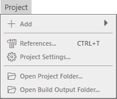
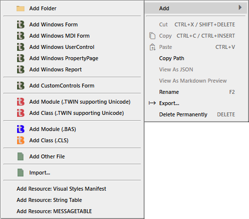

# 项目菜单

- 添加
---
- 引用
- 项目设置
---
- 打开项目文件夹...
- 打开生成输出文件夹...

## 添加

**添加**与在[项目资源管理器](/official/IDE/Project-Explorer)中右键添加的功能相同。

## 引用

参见按"project.references"筛选的[项目设置](/official/IDE/Project-Settings)。

## 项目设置

参见[项目设置](/official/IDE/Project-Settings)。