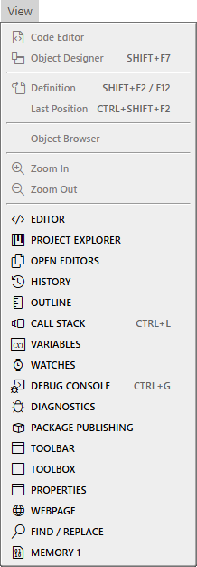

# 视图菜单

- 代码编辑器
- 对象设计器 <kbd>SHIFT</kbd> + <kbd>F7</kbd>
---
- 定义 <kbd>SHIFT</kbd> + <kbd>F2</kbd> / <kbd>F12</kbd>
- 上次位置 <kbd>CTRL</kbd> + <kbd>SHIFT</kbd> + <kbd>F2</kbd>
---
- 对象浏览器
- 放大
- 缩小
---
- 编辑器
- 项目资源管理器
- 打开的编辑器
- 历史记录
- 大纲
- 调用堆栈 <kbd>CTRL</kbd> + <kbd>L</kbd>
- 变量
- 监视
- 调试控制台 <kbd>CTRL</kbd> + <kbd>G</kbd>
- 诊断
- 包发布
- 工具栏
- 工具箱
- 属性
- 网页
- 查找/替换
- 内存 1