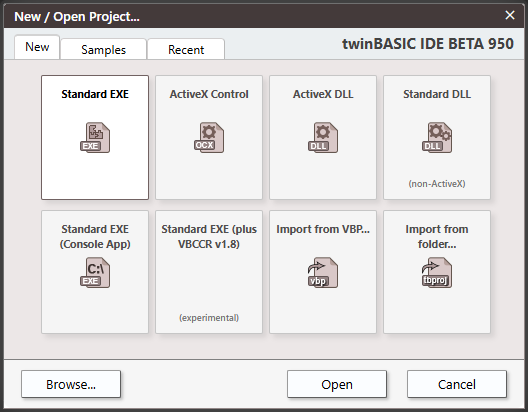
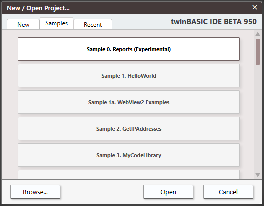
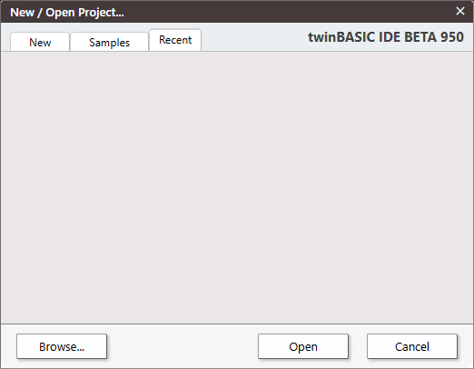
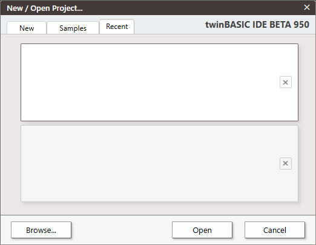

# 新建项目

")

快捷键：<kbd>CTRL</kbd> + <kbd>N</kbd>

## 选项

- 标准 Exe
- ActiveX 控件
- ActiveX DLL
- 标准 DLL
- 标准 EXE（控制台应用）
- 标准 EXE（附带 VBCCR v1.8）
- 从 VBP 导入...
- 从文件夹导入...

浏览 \| 打开 \| 取消

# 示例

0. 报表（实验性）
1. WebView2 示例
2. GetIPAddress
3. MyCodeLibrary
4. MyVBEAddin（含 ToolWindow）
5. MyCOMAddin
6. CustomControls
7. Package
8. FilePropertyViewer（CustomControls）
9. ActiveX 控件 WebView2 + Monaco
10. twinBASIC IDE Addin
11. twinBASIC IDE Addin（图表）
12. twinBASIC IDE Addin（Monaco）
13. twinBASIC IDE Addin（ListView）
14. twinBASIC IDE Addin（VirutalListView）
15. twinBASIC IDE Addin（全局搜索）
16. twinBASIC IDE Addin（TODO 组件演示）
17. 静态库示例（SQLITE3）
18. 静态库示例（libdeflate）
19. MDI 窗体
20. TreeView + ListView + ImageList
21. Windows 服务简单示例
22. Windows 服务复杂示例（含事件日志和 IPC）
23. OOP 继承示例（Animals）

# 最近

如果从未打开过项目，或已移除所有项目，此选项卡将为空白。

将显示最近项目的列表，列表会根据项目数量自动调整大小。

_移除路径_

点击 X 可从列表中移除。