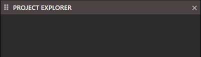
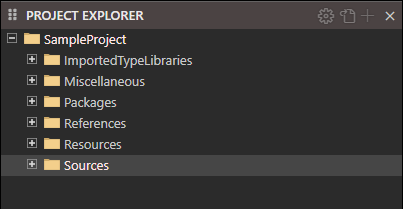
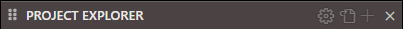
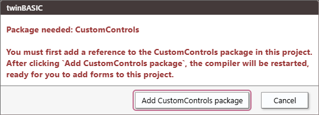

# 项目资源管理器




 导入的类型库
 杂项
 包
 引用
 资源
 源文件

项目打开时会出现上下文图标。



##  项目设置

- [信息](/official/IDE/Project-Settings)

##  切换文件视图 (<kbd>CTRL</kbd> + <kbd>R</kbd>)


##  添加...

与右键相同

## 右键 - 添加


-  添加文件夹
-  添加 Windows 窗体
-  添加 Windows MDI 窗体
-  添加 Windows UserControl
-  添加 Windows 属性页
-  添加 Windows 报表

---

-  添加 CustomControls 窗体

---

-  添加模块 (.TWIN 支持 Unicode)
-  添加类 (.TWIN 支持 Unicode)

---

- ") 添加模块 (.BAS)
- ") 添加类 (.CLS)

---

-  添加其他文件

---

-  导入

---

- 添加资源：视觉样式清单
- 添加资源：字符串表
- 添加资源：MESSAGETABLE

##  文件夹
##  Windows 窗体
[tbForm](/official/IDE/tbForm)

##  Windows MDI 窗体
##  Windows UserControl
##  Windows 属性页
##  Windows 报表
[tbReport](/official/IDE/tbReport)

##  CustomControls 窗体


##  模块
##  类
##  其他文件
##  导入
## 资源：视觉样式清单

参见  `/.../Resources/MANIFEST/#1.xml`

```xml
<?xml version="1.0" encoding="UTF-8" standalone="yes"?>
<assembly xmlns="urn:schemas-microsoft-com:asm.v1" manifestVersion="1.0">
   <assemblyIdentity
      type="win32"
      processorArchitecture="*"
      name="My_twinBASIC_Application"
      version="1.0.0.0"
   />
   <description>Application description here</description>
   <dependency>
      <dependentAssembly>
         <assemblyIdentity
            type="win32"
            processorArchitecture="*"
            name="Microsoft.Windows.Common-Controls"
            version="6.0.0.0"
            publicKeyToken="6595b64144ccf1df"
            language="*"
         />
      </dependentAssembly>
   </dependency>
</assembly>
```

## 资源：字符串表

参见  `/.../Resources/STRING/Strings.json`

```json
[
    {
        "id": 101,
        "name": "MyLocalizedString1",
        "LCID_0000": "This is my NEUTRAL text for MyLocalizedString1",
        "LCID_0409": "This is my USA text for MyLocalizedString1",
        "LCID_0407": "This is my GERMAN text for MyLocalizedString1",
        "LCID_0809": "This is my UK text for MyLocalizedString1"
    },
    {
        "id": 102,
        "name": "MyLocalizedString2",
        "LCID_0000": "This is my NEUTRAL text for MyLocalizedString2",
        "LCID_0409": "This is my USA text for MyLocalizedString2",
        "LCID_0407": "This is my GERMAN text for MyLocalizedString2",
        "LCID_0809": "This is my UK text for MyLocalizedString2"
    }
]
```

## 资源：MESSAGETABLE

参见  `/.../Resources/MESSAGETABLE/Strings.json`

```json
{
    "events": 
    [
        {
            "id": -1073610751,
            "name": "service_started",
            "LCID_0000": "%1 service started"
        },
        {
            "id": -1073610750,
            "name": "service_startup_failed",
            "LCID_0000": "%1 service startup failed"
        },
        {
            "id": -1073610749,
            "name": "service_ended",
            "LCID_0000": "%1 service ended"
        },
        {
            "id": -1073610748,
            "name": "service_stopping",
            "LCID_0000": "%1 service stopping"
        }
    ],
    "categories": 
    [
        {
            "id": 1,
            "name": "status_changed",
            "LCID_0000": "Status Changed"
        }
    ]
}
```