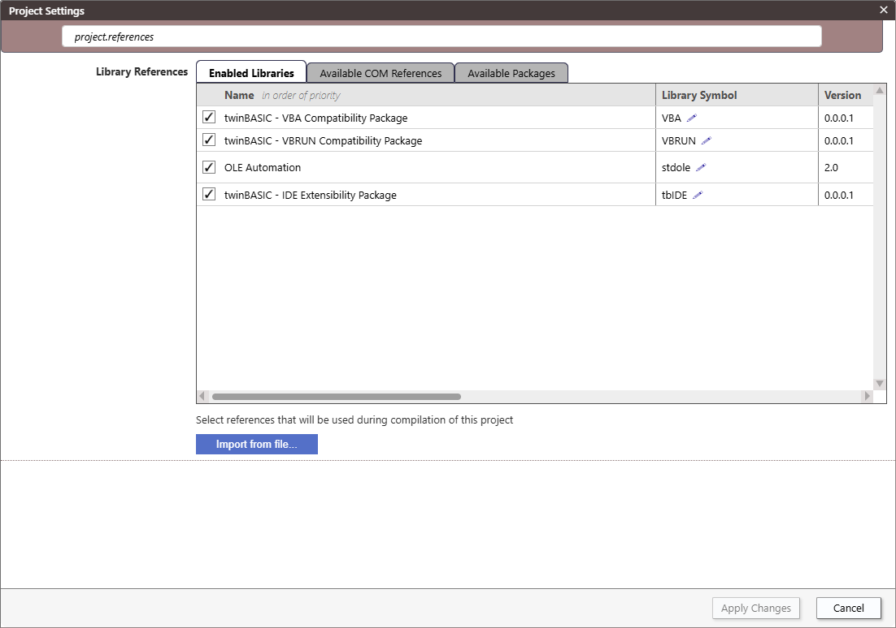
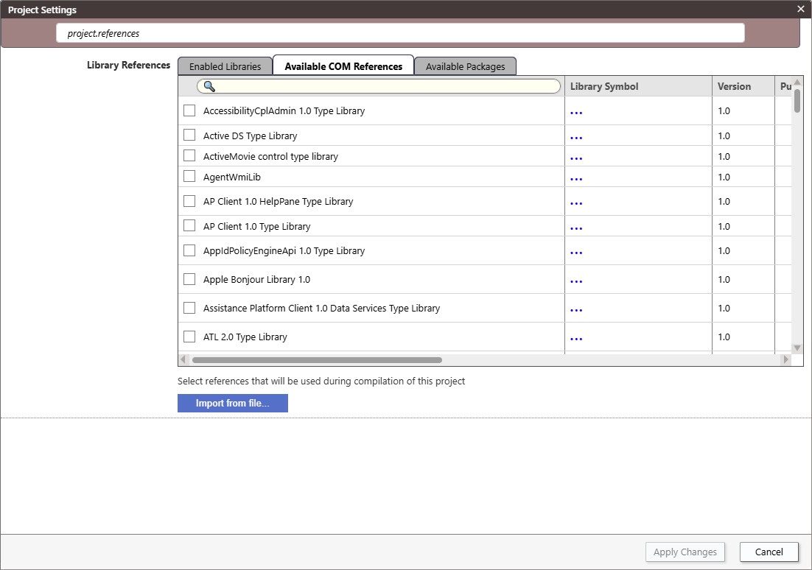

# Project Settings

Listed below are the project settings, in the same order as they appear in the Project Settings dialog. The explanations of those settings will be added below in the future. In the meantime, please refer to the setting descriptions built into the Project Settings dialog:

## Project Name

## Project Description

## Application Title

## Application HelpFile

## Startup Object

## Icon Form

## Library References

See [Packages](/official/Features/Packages/)

## Compiler Warnings

## Project ID

## Use Project ID for type library ID

## Build Output Path

## Build Type

## Licence Type

## Package Visibility

## VERSION Resource

### Major/Minor/Build

### Product Name

### Company Name

### File Description

### Legal Copyright

### Legal Trademarks

### Comments

### Auto-Increment

## Type Library Version

### Major/Minor
### Auto-Increment
## Register DLLs to HKLM

## COM Initialization

## Is Console Application

## Native Subsystem

## Override Entry Point

## Runtime Binding of DLL Declares

## Conditional Compilation Args

## Option Explicit On

## Auto Prettify Source Code

## CodeLens - Show Run Procedure
## Runtime Windows Codepage

## Use Unicode Standard Library

## Unicode Control Notifications

## Include Procedure Name Symbols in Built Executables
## Trace Flags

## Trace Output

## Disable Overflow Checks

## Disable Array Bounds Checks

## Disable FPU Error Checks

## Sanitize Booleans

## Constant Function Folding

## Large Address Aware (LAA)
## Terminal Server Avare
## Data Execution Prevention Aware (DEP)
## Export

### Export Path

### Export After Save

### Export Verbose

## Force DPI Awareness At Startup
## Runtime Command Line Args

## Immediate Memory Invalidation

## Break On All Errors

## Build Stack Reserve Size

## Target OS Version

## Codegen Model

## Strip PE File Relocation Symbols
## Enable Address Space Layout Randomization (ASLR)
## PE File Image Base Address (Win32)
## PE File Image Base Address (Win64)

## Debuggable

## Feature Flags

