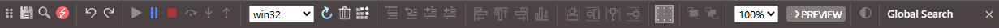

# 工具栏

- 全部保存 (<kbd>CTRL</kbd> + <kbd>S</kbd>)
- 在项目中查找... (<kbd>CTRL</kbd> + <kbd>SHIFT</kbd> + <kbd>F</kbd>) (<kbd>CTRL</kbd> + <kbd>⇧</kbd> + <kbd>F</kbd>)
- 在窗体和代码之间切换
- 撤销
- 重做
- 启动/继续 (<kbd>F5</kbd>)
- 中断到代码 (<kbd>CTRL</kbd> + <kbd>BREAK</kbd>)
- 停止
- 逐过程 (<kbd>SHIFT</kbd> + <kbd>F8</kbd> / <kbd>F10</kbd>)
- 逐语句 (<kbd>F8</kbd> / <kbd>F10</kbd>)
- 跳出 (<kbd>CTRL</kbd> + <kbd>SHIFT</kbd> + <kbd>F8</kbd> / <kbd>SHIFT</kbd> + <kbd>F11</kbd>)
- 选择构建配置
- 重启编译器
- 清理（注销并删除构建）
- 构建
- 注释选区 (<kbd>CTRL</kbd> + <kbd>K</kbd>)
- 取消注释选区 (<kbd>CTRL</kbd> + <kbd>SHIFT</kbd> + <kbd>K</kbd>)
- 缩进块 (<kbd>CTRL</kbd> + <kbd>[</kbd>)
- 减少缩进块 (<kbd>CTRL</kbd> + <kbd>]</kbd>)
- 将控件向左对齐 (<kbd>ALT</kbd> + <kbd>ARROWLEFT</kbd>)
- 将控件向上对齐 (<kbd>ALT</kbd> + <kbd>ARROWUP</kbd>)
- 将控件向右对齐 (<kbd>ALT</kbd> + <kbd>ARROWRIGHT</kbd>)
- 将控件向下对齐 (<kbd>ALT</kbd> + <kbd>ARROWDOWN</kbd>)
- 将控件调整为最宽 (<kbd>CTRL</kbd> + <kbd>SHIFT</kbd> + <kbd>ARROWRIGHT</kbd>)
- 将控件调整为最高 (<kbd>CTRL</kbd> + <kbd>SHIFT</kbd> + <kbd>ARROWDOWN</kbd>)
- 将控件调整为最窄 (<kbd>CTRL</kbd> + <kbd>SHIFT</kbd> + <kbd>ARROWLEFT</kbd>)
- 将控件调整为最矮 (<kbd>CTRL</kbd> + <kbd>SHIFT</kbd> + <kbd>ARROWUP</kbd>)
- 切换网格指示器开/关
- 将选定控件移到 z 序前面
- 将选定控件移到 z 序后面
- 窗体设计器缩放比例
- 隔离启动窗体以测试功能
- 更改 IDE 主题
- 全局搜索