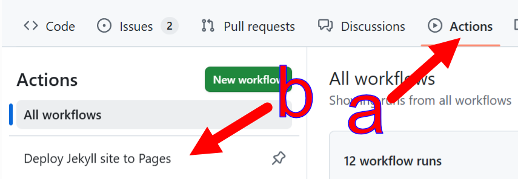

# 文档开发
{: .no_toc }

本章涵盖文档的使用（例如在IDE中）以及内容本身的开发过程。

* 目录将显示在这里
{:toc}

## 永久链接

文档树的稳定版本（机器可访问部分）以`/tB/`前缀为根。具有此前缀的URL以及内部链接（例如[`docs.twinbasic.com/tB/Modules/Math#round`](../tB/Modules/Math#round)）都是稳定的。

### /tB/Core/\<Statement\>

- [AppActivate](../tB/Core/AppActivate)
- [Beep](../tB/Core/Beep)
- [Call](../tB/Core/Call), [ChDir](../tB/Core/ChDir), [ChDrive](../tB/Core/ChDrive), [Class](../tB/Core/Class), [Close](../tB/Core/Close), [CoClass](../tB/Core/CoClass), [Const](../tB/Core/Const), [Continue](../tB/Core/Continue)
- [Date](../tB/Core/Date), [Declare](../tB/Core/Declare), [Deftype](../tB/Core/Deftype), [DeleteSetting](../tB/Core/DeleteSetting), [Dim](../tB/Core/Dim), [Do-Loop](../tB/Core/Do-Loop)
- [End](../tB/Core/End), [Enum](../tB/Core/Enum), [Erase](../tB/Core/Erase), [Error](../tB/Core/Error), [Event](../tB/Core/Event), [Exit](../tB/Core/Exit)
- [FileCopy](../tB/Core/FileCopy), [For-Next](/tB/Core/For-Next), [For-Each-Next](../tB/Core/For-Each-Next), [Function](../tB/Core/Function)
- [Get](../tB/Core/Get), [GetSetting](../tB/Core/GetSetting), [GoSub-Return](../tB/Core/GoSub-Return), [GoTo](../tB/Core/GoTo)
- [If-Then-Else](../tB/Core/If-Then-Else), [Implements](../tB/Core/Implements), [Input](../tB/Core/Input), [Interface](../tB/Core/Interface), [Is](../tB/Core/Is)
- [Kill](../tB/Core/Kill)
- [LBound](../tB/Core/LBound), [Let](../tB/Core/Let), [Line-Input](../tB/Core/Line-Input), [Load](../tB/Core/Load), [Lock](../tB/Core/Lock), [LSet](../tB/Core/LSet)
- [Mid-equals](../tB/Core/Mid-equals) for `Mid(...) = ...` , [MidB-equals](../tB/Core/MidB-equals) for `MidB(...) = ...`, [MkDir](../tB/Core/MkDir), [Module](../tB/Core/Module)
- [Name](../tB/Core/Name), [New](../tB/Core/New)
- [Option](../tB/Core/Option), [On-Error](../tB/Core/On-Error), [On-GoSub](../tB/Core/On-GoSub), [On-GoTo](../tB/Core/On-GoTo), [Open](../tB/Core/Open)
- [ParamArray](../tB/Core/ParamArray), [Print](../tB/Core/Print), [Private](../tB/Core/Private), [Property](../tB/Core/Property), [Protected](../tB/Core/Protected), [Public](../tB/Core/Public), [Put](../tB/Core/Put)
- [RaiseEvent](../tB/Core/RaiseEvent), [ReDim](../tB/Core/ReDim), [Reset](../tB/Core/Reset), [Resume](../tB/Core/Resume), [RmDir](../tB/Core/RmDir), [RSet](../tB/Core/RSet)
- [SavePicture](../tB/Core/SavePicture), [SaveSetting](../tB/Core/SaveSetting), [Seek](../tB/Core/Seek), [Select-Case](../tB/Core/Select-Case), [SendKeys](../tB/Core/SendKeys), [Set](../tB/Core/Set), [SetAttr](../tB/Core/SetAttr), [Static](../tB/Core/Static), [Sub](../tB/Core/Sub), [Stop](../tB/Core/Stop)
- [Time](../tB/Core/Time), [Type](../tB/Core/Type)
- [Unload](../tB/Core/Unload), [Unlock](../tB/Core/Unlock)
- [While-Wend](../tB/Core/While-Wend), [Width](../tB/Core/Width), [With](../tB/Core/With), [Write](../tB/Core/Write)

### /tB/Modules/\<ModuleName\>#\<procedure\>

在每个模块内，除非另有说明，过程和语句都是内部链接，例如[**LenB**: /tB/Modules/Strings#lenb](../tB/Modules/Strings#lenb)。带有`$`后缀的版本具有以`-1`结尾的参考链接，例如[**LenB$**: /tB/Modules/Strings#lenb-1](../tB/Modules/Strings#lenb-1)。

类似地，当过程和语句是独立页面时，例如[**Date$**: /tB/Modules/DateTime/Date#date-1](../tB/Modules/DateTime/Date#date-1)，带`$`后缀的版本具有以`-1`结尾的参考链接。

这些是VBA和VBRUN中的模块：

- VBA
  - [Collection](../tB/Modules/Collection)
  - [Compilation](../tB/Modules/Compilation)
  - [Constants](../tB/Modules/Constants)
  - [Conversion](../tB/Modules/Conversion)
  - [DateTime](../tB/Modules/DateTime)
  - [ErrObject](../tB/Modules/ErrObject)
  - [ExpressionService](../tB/Modules/ExpressionService)
  - [FileSystem](../tB/Modules/FileSystem)
  - [Financial](../tB/Modules/Financial)
  - [Information](../tB/Modules/Information)
  - [Interaction](../tB/Modules/Interaction)
  - [Math](../tB/Modules/Math)
  - [Strings](../tB/Modules/Strings)
  - [TextEncodingConstants](../tB/Modules/TextEncodingConstants)
  - 内部[_HiddenModule](../tB/Modules/_HiddenModule)
- VBRUN
  - [AmbientProperties](../tB/Modules/AmbientProperties)
  - [AsyncProperty](../tB/Modules/AsyncProperty)
  - [Constants](../tB/Modules/Constants)
  - [ContainedControls](../tB/Modules/ContainedControls)
  - [DataMembers](../tB/Modules/DataMembers)
  - [DataObject](../tB/Modules/DataObject)
  - [ErrorCallstack](../tB/Modules/ErrorCallstack)
  - [ErrorContext](../tB/Modules/ErrorContext)
  - [ErrorStackFrame](../tB/Modules/ErrorStackFrame)
  - [Hyperlink](../tB/Modules/Hyperlink)
  - [ParentControls](../tB/Modules/ParentControls)
  - [PropertyBag](../tB/Modules/PropertyBag)

### /tB/Core/Attributes#\<attribute\>

> [!NOTE]
>
> 所有非字母字符以及参数都从链接中移除。所有属性名称在链接中都是小写的。例如`ArrayBoundsChecks(Bool)`被引用为`/tB/Core/Attributes#arrayboundschecks`。

- [AppObject](../tB/Core/Attributes#appobject), [ArrayBoundsChecks](../tB/Core/Attributes#arrayboundschecks)
- [BindOnlyIfNoArguments](../tB/Core/Attributes#bindonlyifnoarguments), [BindOnlyIfStringSuffix](../tB/Core/Attributes#bindonlyifstringsuffix)
- [ClassId](../tB/Core/Attributes#classid), [ClassInterface](../tB/Core/Attributes#classinterface), [CoClassCustomConstructor](../tB/Core/Attributes#coclasscustomconstructor), [CoClassId](../tB/Core/Attributes#coclassid), [COMControl](../tB/Core/Attributes#comcontrol), [COMCreatable](../tB/Core/Attributes#comcreatable), [COMExtensible](../tB/Core/Attributes#comextensible), [ComImport](../tB/Core/Attributes#comimport), [CompileIf](../tB/Core/Attributes#compileif), [CompilerOptions](../tB/Core/Attributes#compileroptions), [ConstantFoldable](../tB/Core/Attributes#constantfoldable), [ConstantFoldableNumericsOnly](../tB/Core/Attributes#constantfoldablenumericsonly)
- [Debuggable](../tB/Core/Attributes#debuggable), [DebugOnly](../tB/Core/Attributes#debugonly), [DefaultMember](../tB/Core/Attributes#defaultmember), [Description](../tB/Core/Attributes#description), [DispId](../tB/Core/Attributes#dispid), [DispInterface](../tB/Core/Attributes#dispinterface), [DllExport](../tB/Core/Attributes#dllexport), [DLLStackCheck](../tB/Core/Attributes#dllstackcheck), [DualInterface](../tB/Core/Attributes#dualinterface)
- [EnforceErrors](../tB/Core/Attributes#enforceerrors), [EnforceWarnings](../tB/Core/Attributes#enforcewarnings), [EnumId](../tB/Core/Attributes#enumid), [EventInterfaceId](../tB/Core/Attributes#eventinterfaceid), [EventsUseDispInterface](../tB/Core/Attributes#eventsusedispinterface)
- [Flags](../tB/Core/Attributes#flags), [FloatingPointErrorChecks](../tB/Core/Attributes#floatingpointerrorchecks), [FormDesignerId](../tB/Core/Attributes#formdesignerid), [Hidden](../tB/Core/Attributes#hidden)
- [IdeButton](../tB/Core/Attributes#idebutton), [IgnoreWarnings](../tB/Core/Attributes#ignorewarnings), [IntegerOverflowChecks](../tB/Core/Attributes#integeroverflowchecks), [InterfaceId](../tB/Core/Attributes#interfaceid)
- [MustBeQualified](../tB/Core/Attributes#mustbequalified)
- [OleAutomation](../tB/Core/Attributes#oleautomation)
- [PackingAlignment](../tB/Core/Attributes#packingalignment), [PopulateFrom](../tB/Core/Attributes#populatefrom), [PredeclaredID](../tB/Core/Attributes#predeclaredid), [PreserveSig](../tB/Core/Attributes#preservesig)
- [Restricted](../tB/Core/Attributes#restricted), [RunAfterBuild](../tB/Core/Attributes#runafterbuild)
- [Serialize](../tB/Core/Attributes#serialize), [SetDllDirectory](../tB/Core/Attributes#setdlldirectory), [SimplerByVals](../tB/Core/Attributes#simplerbyvals)
- [TestCase](../tB/Core/Attributes#testcase), [TestFixture](../tB/Core/Attributes#testfixture), [TypeHint](../tB/Core/Attributes#typehint)
- [Unimplemented](../tB/Core/Attributes#unimplemented), [UseGetLastError](../tB/Core/Attributes#usegetlasterror), [UserDefinedTypeIsAnAlias](../tB/Core/Attributes#userdefinedtypeisanalias)
- [WindowsControl](../tB/Core/Attributes#windowscontrol)

## 开发环境

文档使用[Jekyll][jekyllrb]构建（渲染为HTML）。

1. 确保满足必要的[要求](#要求)和[附加要求](#附加要求)。

2. 如果您计划进行任何更改或为了方便，请将[https://github.com/twinbasic/documentation][docs-repo]分叉到您自己的GitHub账户。如果您只想构建文档而不进行更改，则可以跳过此步骤。

3. 克隆第2步中的分叉仓库或[文档仓库本身][docs-repo]。

4. **转到克隆的工作树中的`/docs`文件夹。**构建、服务和其他文档操作都在此文件夹中完成，*而不是*在仓库根目录中。

### 要求

必须安装Jekyll和Ruby。

- [在Windows上通过RubyInstaller安装Jekyll](https://jekyllrb.com/docs/installation/windows/#installation-via-rubyinstaller)

同时确保Jekyll在PATH中。要在Windows上调整路径，请按<kbd>⊞ R</kbd>，输入`SystemPropertiesAdvanced` <kbd>Enter</kbd>，然后点击**环境变量...**按钮。

### 构建

要构建文档，即从`.md`文件渲染到`_site`文件夹：

    bundle exec jekyll build

或者，仅在Windows上：

    build.bat

### 检查链接完整性

在检查链接完整性之前，必须构建文档。这可以通过[构建](#构建)临时完成，或者通过[构建和服务](#构建和本地服务)在后台连续完成。

要检查最新文档构建中的内部链接是否损坏：

    bundle exec htmlproofer ./_site --disable-external --no-enforce-https

或者，仅在Windows上：

    check.bat

### 构建和本地服务

要从http://localhost:4000构建和服务文档：

    bundle exec jekyll serve

或者，仅在Windows上：

    serve.bat

文档服务器检测文件系统中的更改并根据需要自动重新生成HTML文件。服务器*不会*跟踪`_config.yml`中的更改。如果更改配置，必须重启服务器。通过反复按<kbd>Ctrl</kbd><kbd>C</kbd>来中断服务器。

### Mermaid图表

Mermaid图表支持在` ... `标签内，例如

```

graph TD;
    A-->B;
    A-->C;
    B-->D;
    C-->D;

```

为了方便使用，图表在Jekyll构建/服务期间离线处理。图表被提取、渲染并保存到`assets/images`中。它们是仓库的一部分，`assets/images`中出现的任何新图表都应该添加到git中。渲染使用[mermaid-cli](https://github.com/mermaid-js/mermaid-cli)。

#### 附加要求

要渲染新的或更改的图表，应满足以下条件：

- [nodejs](https://nodejs.org/en/download)
- [mermaid-cli](https://github.com/mermaid-js/mermaid-cli)
  ```
  npm install -g @mermaid-js/mermaid-cli
  ```

## 部署到docs.twinbasic.com

1. 将您的更改推送到[文档仓库][docs-repo]的GitHub分叉。

2. [在文档仓库中打开新的拉取请求][docs-pr]。

3. 点击**跨分叉比较**。

4. 选择您的仓库和要合并的分支。

   

5. 创建拉取请求。

   

   维护者将把拉取请求合并到文档仓库中。您可能希望在[#docs][hash-docs]频道提及待处理的请求，尽管[#github-docs][hash-github-docs]频道提供拉取请求的自动通知。通常，维护者会通过Discord获得新拉取请求的通知，并将合并它或评论要求更改/改进。

   **以下步骤由维护者完成**

6. 审查，然后合并拉取请求或评论所需的更改。

   

   

7. 选择**部署Jekyll站点到Pages**操作。
   {:width="75%"}

8. 手动运行构建和部署工作流，因为它不会自动启动。
   {:width="50%"}


## 编辑截图

编辑截图的一种方法是使用集成的矢量/像素软件，如[Affinity][af]<sup>1</sup>。可能的工作流程是：

1. <kbd>PrtSc</kbd>捕获截图。

2. 在Affinity中，<kbd>Ctrl-Alt-Shift-N</kbd>（文件，从剪贴板新建）将整个截图导入程序。

3. 使用矢量裁剪工具（来自矢量工作室）将截图裁剪到相关部分。

    

4. 选择裁剪后的图像，并复制<kbd>Ctrl-C</kbd>到剪贴板。

5. 再次从剪贴板创建新文件，打开仅包含裁剪截图的文档<kbd>Ctrl-Alt-Shift-N</kbd>（文件，从剪贴板新建）。

6. 关闭在第2步中打开的文件。

7. 根据需要添加箭头和标签。这些可以从本仓库中的其他`.af`文件复制粘贴。

8. 导出为PNG <kbd>Ctrl-Alt-Shift-W</kbd>（文件，导出，导出...）。

>  [!NOTE]
> 惯例是将`.af`（"源"）文件放在`_Images`文件夹中，将导出的`.png`文件放在`Images`文件夹中。只有后者发布到网站。前者仅用于保存源文件以便轻松编辑/更新。

---

<sup>1</sup> Affinity是一款免费软件，结合了矢量编辑器、位图编辑器和发布布局编辑器的功能。要下载，需要Canva账户。账户是免费的。


[af]: https://www.affinity.studio/download

[docs-pr]: https://github.com/twinbasic/documentation/compare
[docs-repo]: https://github.com/twinbasic/documentation
[hash-docs]: https://discord.com/channels/927638153546829845/1021635324809596988
[hash-github-docs]: https://discord.com/channels/927638153546829845/1111554338221989908
[jekyllrb]: https://jekyllrb.com/