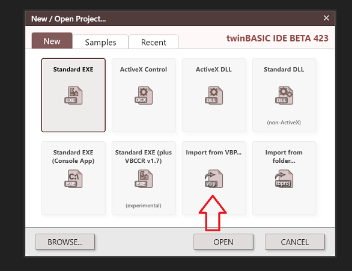
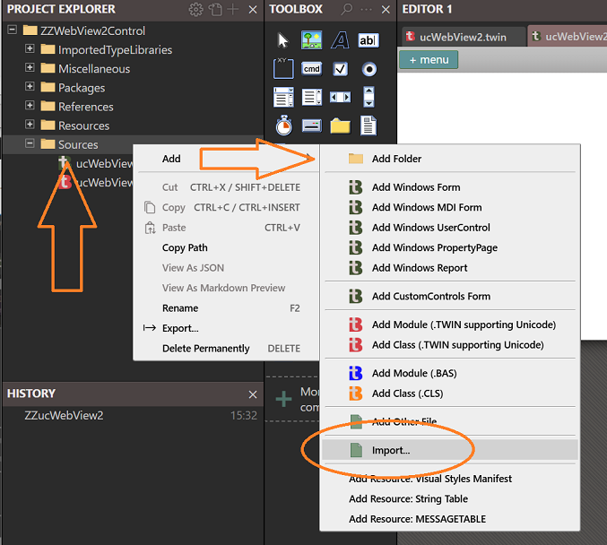
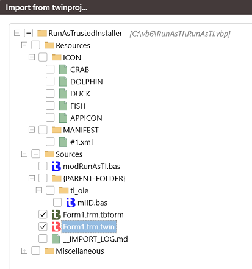
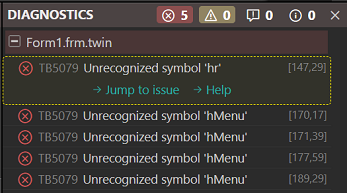
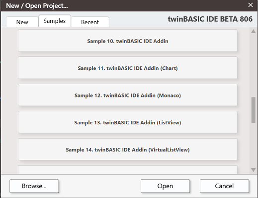
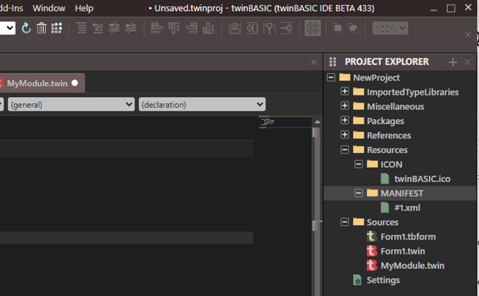
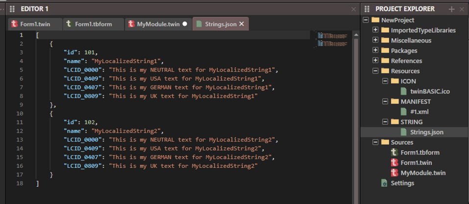

# twinBASIC 常见问题

### [通用](#通用) - [安装](#安装) - [使用 twinBASIC](#使用-twinbasic)

## 通用

<b>twinBASIC是什么？</b>

{: #what-is-twinbasic }

twinBASIC是一种新的BASIC语言和开发环境（IDE），旨在与VB6/VBA保持100%向后兼容。

<b>twinBASIC的背后是谁？</b>

{: #authors }

twinBASIC是Wayne Phillips的作品，他经营着[Everything Access](https://www.everythingaccess.com/)公司，这是一家为Microsoft Access和VBA提供专业服务工具的知名供应商，包括流行的vbWatchdog软件。

<b>我在哪里可以获得twinBASIC？</b>

{: #where-to-get }

最新版本可以从[主要twinBASIC GitHub仓库](https://github.com/twinbasic/twinbasic)的[发布部分](https://github.com/twinbasic/twinbasic/releases)下载。有关安装更多信息，请参见[如何安装twinBASIC](#installation)。

<b>项目的当前状态如何？</b>

{: #current-status }

twinBASIC目前处于**Beta**阶段的后期，正在开发中，尚未达到稳定的1.0版本。所有VB6/VBA7语法和内置函数都已实现。除了OLE控件外，所有基本控件以及大约一半的通用控件都已实现。它支持窗体、类和用户控件——既可以作为编译的OCX/DLL控件，也可以作为项目内代码（即像.ctl文件一样）。然而，这些功能的某些特性，如属性、事件和方法，尚未完成。此外，ActiveX EXE和VBG项目组支持也尚未实现，并且还有相当数量的bug存在。

然而，**tB已经可以运行许多现有项目**，甚至是相当复杂和大型的项目。许多社区成员已经能够毫不费力地将他们的应用程序和其他开源应用程序运行起来，并从头开始创建新项目。查看这些示例可以很好地展示项目的实际进展：

Krool的[VBCCR](https://github.com/Kr00l/VBCCR)和[VBFlexGrid](https://github.com/Kr00l/VBFLXGRD)控件，Ben Clothier的[TwinBasicSevenZip](https://github.com/bclothier/TwinBasicSevenZip)，Carles PV的[Lemmings](https://github.com/fafalone/Lems64)，Don Jarrett的[basicNES](https://github.com/fafalone/basicNES)任天堂模拟器，以及Jon Johnson的[ucShellBrowse/ucShellTree](https://github.com/fafalone/ShellControls)，[FileActivityMon ETW事件跟踪器](https://github.com/fafalone/EventTrace)，[cTaskDialog](https://github.com/fafalone/cTaskDialog64)，以及[更多](https://github.com/fafalone)。

<b>是否有预期功能可用性的估计时间表？</b>

{: #feature-timeline }

是的，请参见Issues部分的[twinBASIC路线图](https://github.com/twinbasic/twinbasic/issues/335)以获取最新的时间表更新。此路线图仅涵盖主要组件；较小的功能以更非正式的方式实现，通常在处理相关代码库时进行。

<b>twinBASIC相比VB6有哪些新功能？</b>

{: #new-features }

**很多！**它具有64位编译（使用VBA7x64兼容语法）、泛型、重载、多线程（目前仅API，内置语法即将推出）、继承、能够使用BASIC风格语法在项目中定义接口和coclass、所有控件和编辑器中的Unicode支持（仅限.twin文件）、对现代图像格式的支持、对*Implements*的众多增强、能够创建标准DLL和内核模式驱动程序、能够设置UDT打包对齐，以及数十个其他功能，所有这些功能都*立即可用*，未来还计划推出更多功能。

有关所有当前可用新功能的完整列表，请参见Wiki文章[twinBASIC新特性概述](Features)。

<b>我可以在哪里了解更多关于twinBASIC的信息，找到文档并参与社区？</b>

{: #to-learn-more }
[twinBASIC主页](https://twinbasic.com)

twinBASIC GitHub：[主要部分](https://github.com/twinbasic/twinbasic) \| [Issues](https://github.com/twinbasic/twinbasic/issues) \| [讨论](https://github.com/twinbasic/twinbasic/discussions) \| [语言设计](https://github.com/twinbasic/lang-design) \| [语言规范](https://github.com/twinbasic/lang-spec) \| [文档](https://docs.twinbasic.com)

[twinBASIC Discord](https://discord.gg/UaW9GgKKuE)

[twinBASIC VBForums论坛](https://www.vbforums.com/forumdisplay.php?108-TwinBASIC)

<b>twinBASIC是开源的吗？</b>

{: #open-source }

虽然未来可能采用开源模式，但目前编译器不是开源的。目前正在计划开源IDE。为了解决这带来的一些主要担忧，一旦tB达到第一个主要版本，源代码将被存放在第三方托管中，以便在作者消失或因死亡或严重疾病/受伤而无法继续开发时向社区发布。

<b>twinBASIC的成本是多少？</b>

{: #cost }

twinBASIC有3个版本：社区版是免费的。编译的64位二进制文件上会放置启动画面，某些功能（如高级优化编译和未来跨平台编译）不可用，但对核心语言功能没有限制或版税要求。要获得这些功能，可以订阅专业版和旗舰版。有关更多详细信息，包括专业版和旗舰版的当前定价，[请参见此页面](https://twinbasic.com/preorder.html)。

> [!NOTE]
> 您可以随时更改订阅级别，社区版始终可用。不会有锁定（参见[关于托管的上一声明](#open-source)），因此您将始终能够开发、测试和编译。

<b>我可以一次性支付费用获得永久许可证吗？</b>

{: #perpetual-license }

由于需要持续收入来开发twinBASIC，订阅是高级版本的主要模式，[可按月或按年提供](https://twinbasic.com/preorder.html)。但是，目前限时提供一次性购买的永久许可证，形式为[VIP Gold终身许可证计划](https://twinbasic.com/vip.html)。这不仅提供了包括更新和新版本的twinBASIC终身许可证，还有许多仅对购买此许可证的人可用的额外好处。

<b>twinBASIC可以用于开发商业产品吗，需要支付什么版税？</b>

{: #commercial-use }

twinBASIC的任何版本都没有限制；它们都可以在免版税的基础上用于开发商业产品。销售用twinBASIC创建的程序或其他产品不需要支付任何费用。但是，twinBASIC软件本身未经适当许可不得重新分发。

<b>从技术上讲，'100%向后兼容'是什么意思？</b>

{: #backwards-compatibility }

向后兼容性指的是匹配所有公开记录的语法、包含的控件、组件和控件行为以及控件外观。它不包括未公开的专有内部实现细节。因此，例如所有语言关键字、函数和方法都存在，并且应该给出相同的结果，窗体/类/用户控件应该实现所有相同的公开记录的接口，但twinBASIC可执行文件在内部结构上并不相同，并且与可执行文件中未公开的VB项目信息结构不兼容，这些结构多年来已被社区逆向工程。

目前，除了OLE控件外，所有基本控件都在twinBASIC中重新实现，支持Unicode和64位编译；许多主要通用控件也已重新实现。最终，将重新实现VB6企业版附带的所有控件。在此之前，原始控件仍将在32位版本中工作，社区成员也提供了一些替代方案，例如Krool的VBCCR控件和VBFlexGrid控件都可以工作，并且有64位兼容的twinBASIC版本。

<b>所以我的一些项目将无法工作？</b>

{: #when-it-does-not-work }

大多数项目不使用这些逆向工程的内部结构，但有些确实使用：最常见的是窗体/类/用户控件内的自子类和回调；也用于多线程和内联汇编。这些例程在twinBASIC中有原生支持，无需内部hack，因此替换少数程序的这些小部分非常简单：支持类成员的`AddressOf`，因此您可以使用常规子类和回调方法，就像它们在.bas模块中一样。可以无需任何特殊步骤调用`CreateThread`。tB支持静态链接的.obj文件，允许合并其他语言的代码，以内联汇编的形式使用`Emit()`/`EmitAny()`插入指令，并计划未来提供更多支持。

此外，twinBASIC重定向用户用作`Declare`语句的最常见msvbvm60.dll（也是msvbvm50.dll/vbe6.dll/vbe7.dll）函数，所有这些函数在x64中也都能工作，如果您像其他DLL定义一样添加`PtrSafe`关键字。以下函数目前有重定向：`VarPtr, GetMem1, GetMem2, GetMem4, GetMem8, PutMem1, PutMem2, PutMem4, PutMem8, __vbaObjSet, __vbaObjSetAddRef, __vbaObjAddRef, __vbaCastObj, __vbaCopyBytes, __vbaCopyBytesZero, __vbaRefVarAry`，和`__vbaAryMove`。您可以继续使用这些函数的`Declare`语句来支持您喜欢的特定签名。此外，olepro32.dll的声明被重定向到oleaut32.dll中的相同函数，因为olepro32被NT4弃用，并且没有64位版本。

除了这些特殊情况外，项目依赖逆向工程内部结构的情况非常罕见。因此，绝大多数项目无需修改即可运行。

<b>如何报告bug或其他问题？</b>

{: #bug-reporting }

最好的方法是[twinBASIC GitHub仓库中创建问题](https://github.com/twinbasic/twinbasic/issues)。

您也可以在[twinBASIC Discord服务器](https://discord.gg/UaW9GgKKuE)的#bugs频道创建帖子。

<b>twinBASIC IDE是否有其他语言版本？</b>

{: #localization }

IDE目前基本支持本地化所有前端UI，翻译由社区成员提供。可以从[tB Discord服务器的#langpacks](https://discord.com/channels/927638153546829845/1329533568376115282)获取，目前有大约10种语言，包括法语、德语、意大利语、葡萄牙语、俄语、简体中文、繁体中文、日语、瑞典语、匈牙利语、希腊语、加泰罗尼亚语、印度尼西亚语（巴哈萨）和马拉雅拉姆语。此后可能发布了其他语言；请查看频道。

悬停信息等内部文本尚不支持本地化，但这计划在未来实现。

## 安装

<b>twinBASIC的系统要求是什么？</b>

{: #system-requirements }

twinBASIC IDE支持Windows 7到Windows 11。安装是便携式的；您只需要解压下载的zip文件然后运行；没有安装程序。

需要WebView2。这在较新版本的Windows上通常已预装，如果您安装了Edge浏览器，它也会随Edge一起安装。您也可以从[Microsoft的网站](https://developer.microsoft.com/en-us/microsoft-edge/webview2?form=MA13LH#download-section)获取。选择独立Evergreen x86版本：

<b>twinBASIC无法运行；提示无效入口点。</b>

{: #invalid-entry-point }

在Windows 7上有时会遇到此问题。要在Windows 7上使用，操作系统必须完全更新；此错误是由于一个或多个更新缺失造成的。运行Windows Update以确保您安装了所有最新更新。如果仍有问题，您可以访问Discord或在GitHub上提交问题（参见[`如何报告bug或其他问题？`](#bug-reporting)）

<b>如何安装twinBASIC？</b>

{: #installation }

tB不需要完整的安装过程，您只需要解压ZIP文件。从[发布页面](https://github.com/twinbasic/twinbasic/releases)下载最新版本，名为`twinBASIC_IDE_BETA_xxx.zip`（其中xxx是版本号；如果文件列表未显示，请点击'Assets'展开）。

下载zip并将其解压到**空**文件夹中。不要简单地覆盖以前的版本；要么删除文件夹中的所有内容，要么使用不同的文件夹。否则可能会出现奇怪的错误。它将从此文件夹运行；某些设置将放在AppData中。

<b>twinBASIC安装有多大？</b>

{: #installation-size }

IDE相当小，目前只有25MB的下载量，解压后约80MB，其中一半是由于LLVM库。

<b>twinBASIC IDE数据存储在哪里？</b>

{: #ide-data-storage }

除了您解压IDE的目录外，twinBASIC还在几个位置存储文件和设置：

- `%APPDATA%\Local\twinBASIC`

- `%APPDATA%\Local\twinBASIC_Admin`

- `%APPDATA%\Local\twinBASIC_WebPanel`

- `%APPDATA%\Local\twinBASIC_WebPanel_Admin`

  (WebView2用户文件夹，这是针对IDE本身的，与您交互的文件/设置不直接相关。其中一些文件夹可能不存在。)

- `%APPDATA%\Roaming\twinBASIC`

  (存储主题、链接包和其他您想在删除以前安装时保留的文件)

- 以及在注册表的`HKEY_CURRENT_USER\Software\VB and VBA Program Settings\twinBASIC_IDE`下

  (当前IDE配置信息；最近项目列表、面板布局、许可证信息、所选主题、键盘快捷键等)

<b>twinBASIC安全吗？（某些扫描器）说它是恶意的。</b>

{: #false-scanner-alerts }

任何曾经在各种防病毒引擎上测试过自己程序的人都知道，除非您的exe是64位并使用高级证书签名（也许即使如此，直到手动添加到信任列表），否则少量的误报只是一种生活方式。twinBASIC的IDE和编译器可执行文件，像所有处于其位置的应用程序一样，可能会在VirusTotal等服务上触发少量阳性结果，特别是32位应用程序。这些几乎总是不是来自主要供应商和/或基于"AI"的算法检测。

## 使用twinBASIC

<b>如何将我的VB6项目导入twinBASIC？</b>

{: #vb6-import }

最简单的方法是通过导入向导。当您首次启动twinBASIC IDE时，会出现新建项目对话框——其中包含'从VBP导入'选项：

您可以通过项目上的添加菜单中的导入选项导入来自VB项目或任何类型的单个文件，或右键单击项目资源管理器窗格中的所需文件夹：

{:style="width:80%; height:auto;"}

> [!NOTE]
> 您可以单独选择.bas/.cls文件，但要导入窗体、用户控件、属性页和资源文件，您目前必须选择它们关联的.vbp文件。然后您将看到一个可以导入的文件列表（带有新的twinBASIC扩展名.tbform/.twin等——确保同时导入两者，例如对于Form1.frm，您将看到Form1.frm.tbform和Form1.frm.twin：

{:style="width:50%; height:auto;"}

<b>为什么我看到很多错误说我的变量未被识别？</b>

{: #unrecognized-variables }

虽然强烈建议使用并被认为是最佳实践，但twinBASIC**不**需要`Option Explicit`。如果您看到这些错误，您可能忽略了一个twinBASIC的新功能：自动在整个项目范围内启用`Option Explicit`。当您导入VB6项目或创建新项目时，会弹出一个小的对话框：

如果保持"Option Explicit ON"选中，这意味着它将在整个项目范围内强制执行，无论窗体/模块等本身是否使用`Option Explicit`。如果取消选中它，您不会因此收到任何错误，只会收到警告："由于Option Explicit为OFF，此变量已被编译器自动声明"。如果需要，您可以在项目设置中禁用该警告：

对于现有项目，可以从项目设置中的"项目：Option Explicit On"打开或关闭项目范围的Option Explicit：

<b>twinBASIC支持插件吗？</b>

{: #addins }

twinBASIC IDE不支持VB6和VBA的插件。但是，tB有自己的基于现代Web技术的强大插件基础设施。请参见新建项目对话框的'Samples'选项卡中的示例10到16：

twinBASIC支持**为VBA创建**插件。它目前是唯一支持使用100%兼容语法的语言为64位Office创建这些插件的工具。请参见示例4和示例5。

插件可以安装到两个位置：

1. `%appdata%\twinBASIC\addins\` - 这是首选位置，因为TwinBasic发行版本身未被修改，并且在升级到较新版本时插件不会丢失。
2. `<twinbasic解压文件夹>\addins\` - 如果您想修改TwinBasic安装。这通常不推荐。

<b>如何在twinBASIC中使用资源？</b>

{: #resources }

目前tB没有专用的资源编辑器；相反，资源通过项目资源管理器管理。在树中，您会看到一个资源文件夹；默认情况下，它将包括标准EXE中的ICON，以及如果您选择启用视觉样式，则包括MANIFEST：

您可以在此处创建额外的文件夹，使用它们的标准名称。例如，可以添加BITMAP组，然后使用`LoadResImage`。与它的前身不同，tB不限制资源类型：您可以创建任何类型的文件夹，并将二进制数据导入其中。例如，一些社区项目已经为Ribbon控件插入了`UIFILE`资源，为属性表插入了`DIALOG`资源。可以通过右键单击您希望资源所在的文件夹，然后从菜单中选择添加->导入文件...来导入资源。

如果您正在导入项目，链接的.res文件中的资源将被自动导入。

#### 字符串

字符串表资源目前被特殊处理；它们在IDE中作为JSON编辑。如果您从带有.res的VBP导入，字符串资源将被自动转换。如果您右键单击'资源'文件夹，然后转到'添加'子菜单，在底部，您会找到"添加资源：字符串表"，它会添加一个包含示例字符串的字符串表：

#### 组名

如果您为标准资源类型创建新文件夹，twinBASIC目前识别以下名称，您应该使用这些名称在资源下创建文件夹：

BITMAP
CUSTOM
CURSOR
ICON
MANIFEST
RCDATA
STRING
MESSAGETABLE

对于其他标准类型，您必须使用#（井号）后跟其数字。例如，对于DIALOG（RT_DIALOG）资源，不要将文件夹命名为dialog，它必须命名为`#5`。ANICURSOR将被命名为`#21`。依此类推，对于具有`RT_`常量的[标准类型](https://learn.microsoft.com/en-us/windows/win32/menurc/resource-types)。对于任何其他类型，您可以使用任何您想要的名称，例如UIFILE可以就命名为UIFILE。

> [!NOTE]
> 目前，.res文件只能作为VBP的一部分导入。

<b>如何为我的程序设置自己的图标？</b>

{: #app-icon }

默认情况下，新建项目使用twinBASIC标志。
导入的项目使用设置中选择的窗体的图标。可以通过相同的方式为所有项目修改或设置：在项目的设置对话框中，有一个"图标窗体"选项，您可以从中选择哪个窗体的图标将用于您的exe。

如果您不设置该选项，或者您的项目不包含窗体，图标可以通过资源文件夹手动管理。
如果您还不熟悉在twinBASIC中使用资源，请参见上面的FAQ条目。在这种情况下，Explorer中用于您的应用程序的图标是资源\ICON文件夹中按字母顺序最先出现的那个。如果您的项目中没有ICON文件夹，您可以通过右键单击资源文件夹并选择添加->添加文件夹来创建一个。

在上图中，MyOwnIcon.ico将被Explorer和其他应用程序用来表示您的.exe，因为它在字母顺序上排在twinBASIC.ico之前。

> [!NOTE]
> 这不会被设置为任何窗体的图标；窗体的图标由属性列表中的"图标"属性设置。

您可以同时设置图标窗体选项并包含额外的ICON资源。在这种情况下，图标窗体将优先-它将被插入为#1，使其成为第一个可能的条目，因此将被Explorer使用。在这种情况下，不要为资源中的任何其他图标使用#1，结果可能不可预测。

<b>twinBASIC生成的EXE/二进制文件的运行时要求是什么？</b>

{: #runtime-requirements }

twinBASIC生成的程序和模块/控件除了标准Windows系统DLL外没有原生依赖，完全是独立的/便携式的，当然除了您的代码可能使用的第三方文件。不需要运行时存在。

目前支持的最低Windows版本是**Windows XP**，未来可能会支持Windows 2000。目前没有支持Windows ME、98、95、NT4或更早版本的计划，因为这些版本缺少tB提供的基本现代化所需的关键功能。

某些新的tB独占功能（如子控件透明度）仅在较新版本中使用这些功能时才需要。

一切都应该在WINE和ReactOS下工作，但测试虽然成功，但很少。如果您尝试，请分享您的经验。

<b>为什么twinBASIC生成的EXE比VB6大？</b>

{: #exe-size }

大部分功能，包括像窗体引擎这样的主要部分，都由VB6应用程序/组件中的msvbvm60.dll运行时提供，这是一个1.4MB的文件。twinBASIC应用程序/控件没有这样的外部依赖；窗体引擎和所有其他功能都包含在单个exe中，因此组合大小并不相差太远。EXE大小预计将在即将推出的LLVM优化编译后显著减小。

