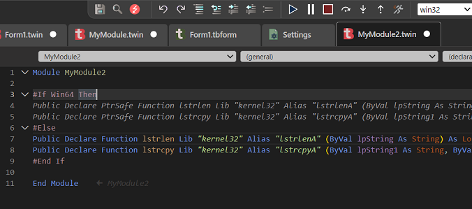

本指南介绍twinBASIC中的内置编译器常量。它包含VBA文档中列出的常量，即使它们未定义也可以使用，因为未定义的编译器常量始终可用，但其值为0。

## `Win16`

**用途：** 指示16位Windows兼容平台。\
**值：** 始终为0（False）；不支持16位Windows。

## `Win32` 

**用途：** 指示32位兼容Windows平台\
**值：** 在受支持的Windows平台上始终为1（True），无论是32位还是64位。

## `Win64`

**用途：** 指示64位Windows AMD64平台。\
**值：** 编译器处于32位模式时为0（False），处于64位模式时为1（True）。

## `VBA6`

**用途：** 指示与VBA6语法的兼容性。\
**值：** 始终为1（True）。

## `VBA7`

**用途：** 指示与VBA7语法的兼容性。\
**值：** 始终为1（True）。

## `MAC`
**用途：** 指示是否在MacOS平台上运行。\
**值：** 始终为0（False）。目前不支持Mac，但将来会改变。

## `TWINBASIC`

**用途：** 指示与twinBASIC语法的兼容性。\
**值：** 始终为1（True）。

## `TWINBASIC_BUILD`

**用途：** 提供一个`Long`值，表示当前twinBASIC构建号。\
**值：** 目前与"BETA"编号相同，例如Beta 610的值为610。

## `TWINBASIC_BUILD_TYPE`
**用途：** 允许根据项目是exe、dll还是ocx进行条件编译。\
**值：** 一个`String`，可以是"Standard EXE"、"Standard DLL"、"ActiveX DLL"或"ActiveX Control"，由项目设置中的"Build Type"选项决定。


# 用法

使用方式遵循在标准`If/Else/ElseIf`条件前加井号号的标准语法。例如，要区分32位和64位VBA与64位twinBASIC：

```vb
#If VBA7 Then
    'We're in either VBA7 or twinBASIC
    #If Win64 Then
        'We're in either 64bit VBA7 or 64bit twinBASIC
        #If TWINBASIC Then
            'We're in 64bit twinBASIC
            #If TWINBASIC_BUILD_TYPE = "ActiveX Control" Then
                'And we're building an OCX
            #End If
        #Else
            'We're in 64bit VBA7
        #End If
    #Else
        'We're in either 32bit VBA7 or 32bit twinBASIC
        #If TWINBASIC Then
            'We're in 32bit twinBASIC
        #Else
            'We're in 32bit VBA7
        #End If
    #End If
#Else
    'We're in VB6 or VBA6. Win64 will always be False by default. TWINBASIC will always be False by default.
#End If
```

或者更简单地，判断是否使用`PtrSafe`、`DeclareWide`或其他tB功能：

```vb
#If VBA7 Then
    #If TWINBASIC Then
        'PtrSafe DeclareWide declares, if desired, also inline comments and `[ TypeHint() ]`, and function attributes.
    #Else
        'PtrSafe declares not using DeclareWide or any new syntax
    #End If
#Else
    'Classic VB6/VBA6 declares without PtrSafe or other new syntax
#End If
```

::: important
提醒：编译器常量不是`Boolean`值，因此不应使用`#If Not Win64 Then`这样的语法，因为结果可能不符合预期。例如，该表达式在32位和64位模式下都会求值为`True`，而你可能期望在64位下为`False`以使用仅限32位的代码。\
:::
如果希望将它们视为`Boolean`，可以使用`CBool()`函数，例如`#If Not CBool(Win64) Then`。

# 外观

tB编辑器具有实时显示编译器常量是否处于活动状态的有用功能。`#If`块中不会在当前设置下执行的代码会显示为灰色。注意，与VBx不同，不活动的代码不会进行错误检查。

例如，在32位模式下：\


切换到64位模式后：\


---
*VB6、VBA、VBA6和VBA7是Microsoft Corporation的商标。*\
*MacOS是Apple, Inc.的商标。*