# 从twinBASIC驱动Monaco

结合前面教程所有内容的案例研究：一个包含**两个**[**CefBrowser**](/official/Reference/CEF/CefBrowser/)控件的窗体——左侧是Microsoft Monaco编辑器，右侧是实时HTML预览。用户输入时，Monaco将编辑的源代码发送给twinBASIC，后者将其镜像到预览面板。

完整项目以*示例1b——Chromium Embedded Framework示例*的形式在新项目对话框中提供（窗体*示例3*）。

## 架构



编辑器作为本地Web应用在虚拟主机名下运行；预览面板通过[**NavigateToString**](/official/Reference/CEF/CefBrowser/#navigatetostring)接收原始HTML。

## 运行时版本要求

Monaco使用较旧Chromium版本中不存在的现代JavaScript功能。示例在启动时检查并警告加载的运行时是否太旧：

```vb
If WebView.CefMajorVersion < 109 Then
    MsgBox "Sorry, Monaco is not supported by this old version of CEF."
End If
```

实际上这意味着本教程需要**v109**或**v145**——**v49**缺少Monaco依赖的JavaScript API。参见[入门](/official/Tutorials/CEF/Getting-started)了解如何选择正确的包引用。

## 设置编辑器资源

Monaco编辑器是一个约2MB的JavaScript、CSS和字体文件集合。将它们放入项目的 `Resources` 子文件夹——命名为 `MONACO_DEMO`——连同 `index.html`和一个小的引导 `script.js`。[托管本地Web资源](/official/Tutorials/CEF/Hosting-local-web-assets)教程描述了布局。

页面本身是一个 `<div id='container'>` 加上监听宿主*初始内容*消息的引导脚本：

```html
<!DOCTYPE html>
<html>
    <head>
        <script src="/vs/loader.js"></script>
        <script src="/script.js"></script>
        <link rel="stylesheet" href="/styles.css">
    </head>
    <body>
        <div id="container"></div>
    </body>
</html>
```

```js
window.chrome.webview.addEventListener('message', (event) => {
    let initialHTML = event.data;

    require.config({ paths: { 'vs': 'https://monaco.example/vs' } });
    require(["vs/editor/editor.main"], () => {
        let editor = monaco.editor.create(document.getElementById('container'), {
            value: initialHTML,
            language: 'html',
            theme: 'vs-dark',
            minimap: { enabled: false }
        });

        editor.onDidChangeModelContent(() => {
            // Inform the host of every edit.
            window.chrome.webview.postMessage(editor.getValue());
        });
    });
});
```

## BASIC端

在窗体上放置两个 `CefBrowser` 控件——`WebView`（编辑器）和 `WebViewPreview`（渲染器）。`Ready` 处理程序部署资源、注册虚拟主机并导航：

```vb
Private localPath As String

Private Sub WebView_Ready() Handles WebView.Ready
    localPath = Environ$("USERPROFILE") & "\Documents\tbMonacoDemo"
    CopyResourcesFolderContentsToLocalPath "MONACO_DEMO", localPath

    WebView.SetVirtualHostNameToFolderMapping _
        "monaco.example", localPath & "\"
    WebView.Navigate "https://monaco.example/index.html"
End Sub
```

（`CopyResourcesFolderContentsToLocalPath` 是[托管本地Web资源](/official/Tutorials/CEF/Hosting-local-web-assets)中的辅助过程。）

两个控件共享单个辅助浏览器进程——第一个到达[**Ready**](/official/Reference/CEF/CefBrowser/#ready)的**CefBrowser**启动它，第二个附加到现有进程。这种共享使双面板模式的成本很低。

## 推送初始内容

Monaco加载完成后，引导脚本监听包含用于填充编辑器的HTML的 `message` 事件。在编辑器的[**NavigationComplete**](/official/Reference/CEF/CefBrowser/#navigationcomplete)后发送该消息：

```vb
Private Sub WebView_NavigationComplete( _
        ByVal IsSuccess As Boolean, ByVal WebErrorStatus As Long) _
        Handles WebView.NavigationComplete

    If WebView.DocumentURL <> "https://monaco.example/index.html" Then Exit Sub

    Dim initialHTML As String = _
        StrConv(LoadResData("initial-editor-html.html", "MONACO_DEMO"), vbFromUTF8)

    WebView.PostWebMessage(initialHTML)
    WebViewPreview.NavigateToString(initialHTML)
End Sub
```

[**LoadResData**](/official/Reference/VB/Global/#loadresdata)返回资源字节；`StrConv(..., vbFromUTF8)` 解码它们。[**PostWebMessage**](/official/Reference/CEF/CefBrowser/#postwebmessage)将字符串传递给Monaco的 `message` 监听器；[**NavigateToString**](/official/Reference/CEF/CefBrowser/#navigatetostring)用相同文本渲染HTML来填充预览面板。

顶部的 `If` 守卫很重要——[**NavigationComplete**](/official/Reference/CEF/CefBrowser/#navigationcomplete)对*每次*导航都会触发，包括内部Monaco资源加载。仅在导航到 `index.html` 时填充编辑器。

## 实时预览

Monaco中的每次按键触发其 `onDidChangeModelContent` 回调，该回调将新内容 `postMessage` 回BASIC。这以[**JsMessage**](/official/Reference/CEF/CefBrowser/#jsmessage)事件到达——直接送入预览：

```vb
Private Sub WebView_JsMessage(ByVal Message As Variant) Handles WebView.JsMessage
    WebViewPreview.NavigateToString(Message)
End Sub
```

就是这样——预览面板在每次编辑时重新渲染。

## 检测缺失的运行时

相当一部分用户将在未安装CEF运行时ZIP的机器上运行应用程序。[**Error**](/official/Reference/CEF/CefBrowser/#error)事件报告此情况时附带控件搜索的确切路径：

```vb
Private Sub WebView_Error(ByVal code As Long, ByVal msg As String) _
        Handles WebView.Error
    MsgBox "Failed to initialize the CEF control." & vbCrLf & vbCrLf & _
           "Code: " & Hex$(code) & vbCrLf & _
           msg, vbExclamation, "CEF"
End Sub
```

修复方法是从[github.com/twinbasic/cef-runtimes](https://github.com/twinbasic/cef-runtimes/releases/)安装匹配的运行时ZIP，或者随应用程序一起提供运行时并在[**Create**](/official/Reference/CEF/CefBrowser/#create)事件期间将[**EnvironmentOptions.BrowserExecutableFolder**](/official/Reference/CEF/CefBrowser/EnvironmentOptions#browserexecutablefolder)指向它。安装路径和ZIP文件参见[入门](/official/Tutorials/CEF/Getting-started)。

## 下一步

- [托管本地Web资源](/official/Tutorials/CEF/Hosting-local-web-assets) —— 本教程基于的 `CopyResourcesFolderContentsToLocalPath` 辅助过程和虚拟主机模式。
- [JavaScript互操作](/official/Tutorials/CEF/JavaScript-interop) —— BASIC和JavaScript之间的两座桥。
- [重入性](/official/Tutorials/CEF/Re-entrancy) —— 为什么实时预览模式即使看起来大部分是同步的也是安全的。
- [CefBrowser参考](/official/Reference/CEF/CefBrowser/) —— 每个属性、方法和事件。
- [驱动Monaco（WebView2）](/official/Tutorials/WebView2/Driving-Monaco) —— 使用[**WebView2**](/official/Reference/WebView2/WebView2/)控件的并行实现。