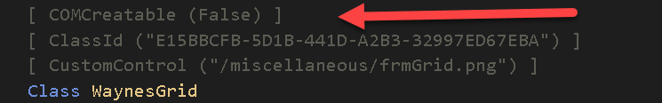
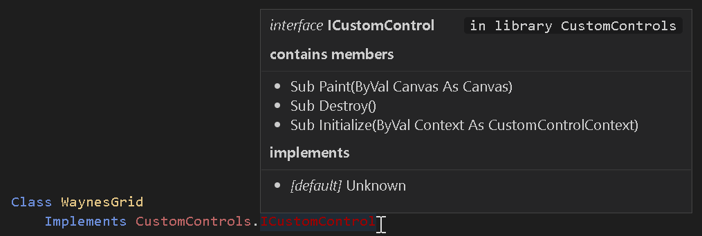

# 定义CustomControl

CustomControl就是一个普通的twinBASIC类，带有一些额外的属性和要求。

::: tip
强烈建议在尝试实现自己的CustomControl之前，先查看并实验twinBASIC提供的示例项目。
:::


***
## CustomControl()属性


这是所有CustomControl的必需属性。你必须提供项目内图片文件的相对路径，用于在窗体设计器工具箱中标识你的控件。我们建议将图片文件放在项目的Miscellaneous文件夹中。


***
##  ClassId()属性


这是所有CustomControl的必需属性。你必须提供唯一的CLSID（GUID），以便窗体引擎与你的控件配合工作。

::: tip
如果你输入 `[ ClassId () ]`，twinBASIC会帮助你——只需点击"insert a randomly generated GUID"文本：
:::


***
##  COMCreatable()属性


这是一个可选属性，但通常建议将此属性设为False，因为你不需要从外部COM环境实例化CustomControl。

***
## 必须实现ICustomControl


所有CustomControl*必须*实现[`CustomControls.ICustomControl`](/official/Reference/CustomControls/Framework/ICustomControl)。该接口当前有3个你必须实现的方法：

```vb
Sub Initialize(ByVal Context As CustomControlContext)
```

此方法在你的控件附加到窗体时调用。你必须将提供的Context对象存储在类字段中，因为它提供了一个 `Repaint()` 方法，用于通知窗体引擎控件中的某些内容已更改并需要重绘。

```vb
Sub Destroy()
```

此方法在你的控件从窗体分离时调用。这提供了打破循环引用的机会，以便你的对象实例可以正确析构。如果你不在对象中创建循环引用，此实现通常可以留空。

```vb
Sub Paint(ByVal Canvas As Canvas)
```

这是CustomControl最有趣的部分。因此它有自己的章节，参见[绘制/绘图到你的控件](/official/Tutorials/CustomControls/Painting-drawing-to-your-control)

***
## 最小属性集

由于twinBASIC尚不支持继承，你必须为所有CustomControl暴露一组公共属性（类字段）：

```vb
Public Name As String
Public Left As CustomControls.PixelCount
Public Top As CustomControls.PixelCount
Public Width As CustomControls.PixelCount
Public Height As CustomControls.PixelCount
Public Anchors As Anchors = New Anchors
Public Dock As CustomControls.DockMode
Public Visible As Boolean
```

窗体设计器和窗体引擎使用这些属性，因此将它们包含在你的CustomControl类中很重要。这里使用的类型都在框架中定义：[`PixelCount`](/official/Reference/CustomControls/Enumerations/PixelCount)、[`DockMode`](/official/Reference/CustomControls/Enumerations/DockMode)和[`Anchors`](/official/Reference/CustomControls/Styles/Anchors)样式对象。

注意，窗体设计器使用的是未经DPI缩放的像素值。因此你的控件的Left/Top/Width/Height属性不反映DPI缩放。例如，如果你的控件宽度为50像素，则在DPI 150%时，实际绘制宽度为75像素（参见[绘制/绘图到你的控件](/official/Tutorials/CustomControls/Painting-drawing-to-your-control)）。

***
## 必须有序列化构造函数

CustomControl*必须*提供序列化构造函数：

```vb
Public Sub New(Serializer As SerializationInfo)
```

传入的Serializer对象提供了一个 `Deserialize()` 方法，你调用它来加载通过窗体设计器为控件设置的属性。更多信息参见[属性表和对象序列化](/official/Tutorials/CustomControls/Property-sheet-and-object-serialization)。

::: info
当前框架将序列化器类型命名为[`SerializeInfo`](/official/Reference/CustomControls/Framework/SerializeInfo)（不是 `SerializationInfo`），`Deserialize()` 暴露为 `RuntimeUISrzDeserialize()`。参见参考页面了解当前成员名称以及该对象上也可用的设计模式/运行时模式标志。
:::

***
## 另见

- [CustomControls包参考](/official/Reference/CustomControls/) —— 框架部分（接口、回调对象、[`Canvas`](/official/Reference/CustomControls/Framework/Canvas)绘图面、[`SerializeInfo`](/official/Reference/CustomControls/Framework/SerializeInfo)序列化器）和基于其构建的内置 `Waynes…` 控件的完整参考。