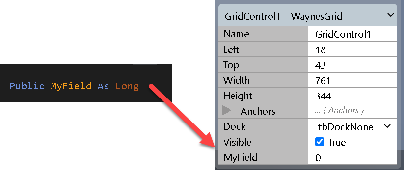
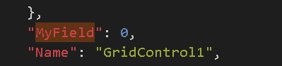
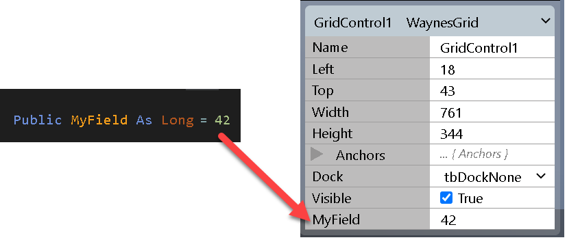
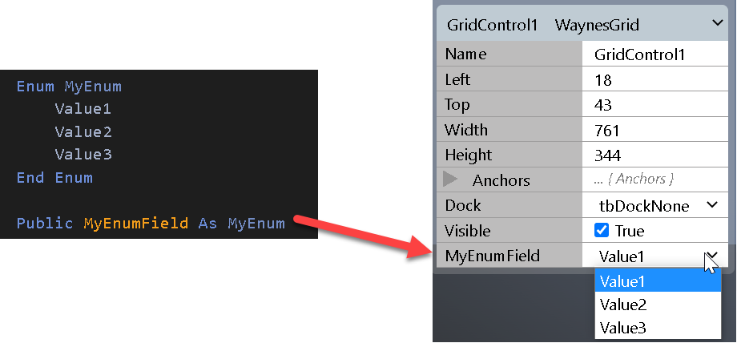
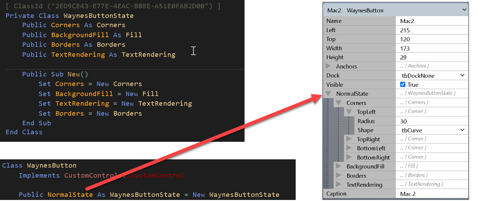
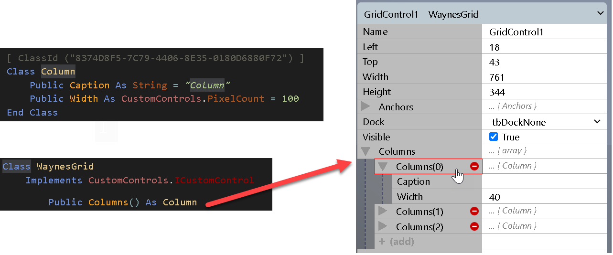
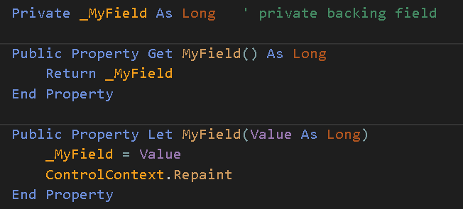
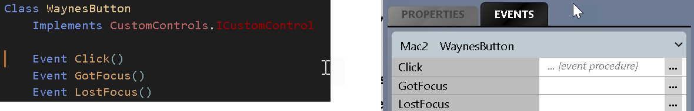

# 属性表和对象序列化
窗体设计器属性表会自动拾取你通过CustomControl类暴露的任何**公共**自定义属性（字段）。例如，添加一个字段 `Public MyField As Long` 将自动显示在窗体设计器的控件属性表中：



然后这会作为属性持久化到你的项目中的窗体JSON结构内：



实现这一功能的关键是你的序列化构造函数，可能类似这样：

```vb
Public Sub New(Serializer As SerializationInfo)
   If Not Serializer.Deserialize(Me) Then
      InitializeDefaultValues  ' you implement this
   End If
End Sub
```

如果 `Deserialize(Me)` 返回 `True`，则你的类属性已与通过窗体设计器设置的属性同步。如果返回 `False`，则控件刚刚被添加到窗体，这让你有机会为自定义公共属性设置适当的默认值。窗体设计器会注意到你在序列化构造函数中设置的默认值，从而使属性表保持同步。

***
## 默认值
设置默认值的另一种方法是将其内联到类字段定义中：



当控件正在从持久化的属性表数据同步时，序列化构造函数内的 `Deserialize(Me)` 调用将覆盖属性值。

***
## 枚举
你在twinBASIC项目中定义的枚举受支持。只需暴露一个枚举类型的类字段：



注意：枚举以字符串形式持久化到窗体JSON结构中，因此在修改/更新CustomControl时请记住这一点，以免通过重命名枚举值引入破坏性变更。

***
## 对象
你在twinBASIC项目中定义的类对象受支持。你***必须***为任何暴露的对象提供ClassId属性，以便序列化可以识别它。



***
## 数组
数组受支持。窗体设计器允许添加新元素、删除元素和重新排序元素（通过拖放）。



***
## Property Get / Let
自定义属性过程受支持。如果你希望属性更改触发控件重绘，你会发现需要使用Property Get / Let过程。



注意，**私有**字段和属性不构成序列化的一部分，因此不会出现在属性表上。

***
## 避免使用Variant
序列化不支持Variant或通用Object。始终使用强类型数据类型。

***
## 事件
你在类中定义的事件将显示在事件属性表中：



目前，窗体设计器尚不支持代码隐藏窗体，因此此功能尚未完成。

::: tip
如果你对CustomControl类进行了更改，如暴露新属性或更改控件的绘制方式，这些更改将立即反映到任何打开的窗体设计器中。当你返回窗体设计器时，它们会显示一个"resync"按钮，按下后更改即可可见。
:::

::: tip
在IDE中运行时序列化通过JSON进行，而在编译的DLL/EXE中运行时通过二进制格式进行。传递给你的序列化构造函数的 `SerializationInfo` 对象在IDE中运行时是不同的实现，但作为CustomControl开发者，这对你应该是透明的。
:::

::: tip
在修改或更新CustomControl时，始终考虑向后兼容性。例如，如果你重命名了一个暴露的属性，旧的通过属性表存储的属性值将不会被反序列化到你的新属性中。
:::

***
## 另见

- [`SerializeInfo`](/official/Reference/CustomControls/Framework/SerializeInfo) —— 当前序列化器类型的参考（上面代码段中的 `SerializationInfo` 名称是较旧的草稿名称；当前类型是 `SerializeInfo`，`Deserialize()` 暴露为 `RuntimeUISrzDeserialize()`）
- [CustomControls包参考](/official/Reference/CustomControls/) —— 框架和内置 `Waynes…` 控件的概述