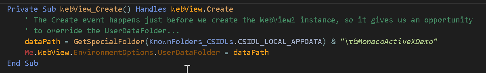

# 自定义UserDataFolder

在运行时，WebView2需要一个工作文件夹来存储会话期间使用的数据。&nbsp;默认情况下，将在可执行文件同目录下创建一个名为 `<FileName>.WebView2` 的文件夹（例如 `MyApp.Exe.WebView2`）。&nbsp;如果此文件夹无法创建，WebView2控件将无法工作（你可以在运行时捕获控件的Error事件来确定此情况）。

这种默认行为并非总是合适的。&nbsp;例如，如果你正在为Microsoft Access创建加载项，那么你几乎肯定不被允许在系统的Program Files文件夹的Office子文件夹中创建名为 `MSACCESS.EXE.WebView2` 的文件夹。

强烈建议你覆盖默认行为，改为提供一个被认为可以安全存储此类数据的路径。要在运行时覆盖UserDataFolder路径，请处理WebView2控件的Create事件。&nbsp;参见此处的 `示例9.  ActiveX Control WebView2 + Monaco` 中的示例，我们使用 `%APPDATA%\Local` 系统路径：

{style="width:80%; height:auto;"}

 
 

将 `EnvironmentOptions.UserDataFolder` 属性设置为包含要使用的输出路径的字符串（文件夹将在必要时创建）。