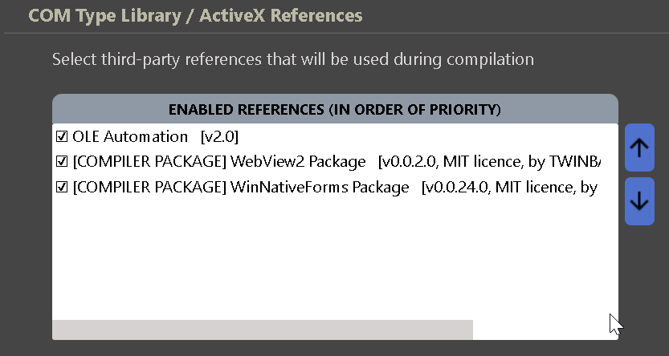
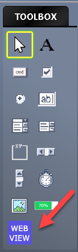
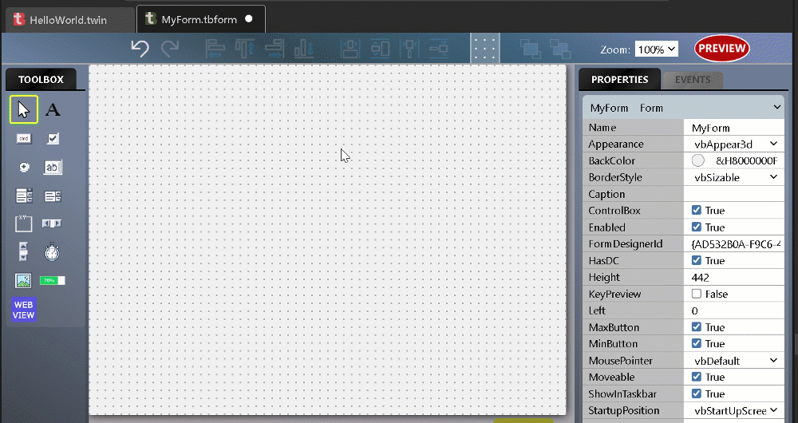
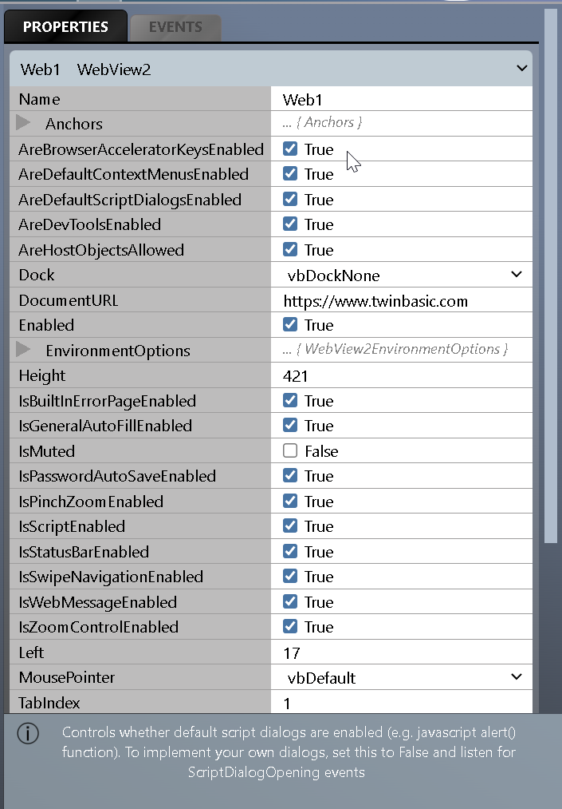
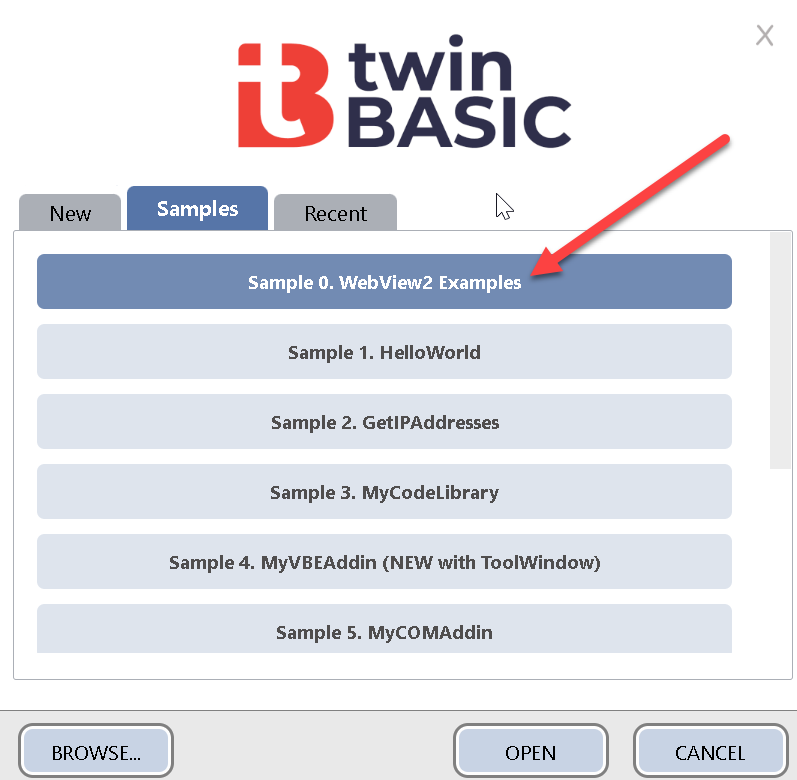

# 入门

## 包要求

要创建使用WebView2的项目，你的项目必须同时包含 `WinNativeForms` 包和 `WebView2` 包。

这两个包都可以通过 `项目` > `引用` 菜单选项添加，选择 `TWINPACK PACKAGES` 按钮。确保两个包都已勾选，然后关闭并保存设置文件并重启编译器。

{style="width:45%; height:auto;"}
 
 

添加包引用后，你应该会发现WebView2控件现在在窗体设计器中可用：

{style="width:15%; height:auto;"}
 
 

## 在窗体上创建WebView2控件

我们像使用任何普通控件一样使用WebView2控件：

{style="width:60%; height:auto;"}
 
 

## WebView2控件属性

WebView2有很多属性和事件可供探索。

{style="width:45%; height:auto;"}
 
 
注意，切换任何属性都会在属性列表底部显示额外信息，提供更多细节。完整参考参见[WebView2控件类](/official/Reference/WebView2/WebView2/)；对于底层浏览器功能，请搜索官方<a href="https://docs.microsoft.com/en-us/microsoft-edge/webview2/">WebView2文档</a>

## 示例

如果你更喜欢从示例开始，请查看 `示例0.  WebView2示例`，可在新建项目对话框中找到：

{style="width:45%; height:auto;"}