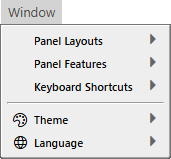
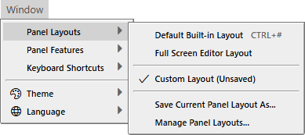

# 窗口菜单



- 面板布局
- 面板功能
- 键盘快捷键
---
- 主题
- 语言

## 面板布局



- 默认内置布局 <kbd>CTRL</kbd> + <kbd>#</kbd>
- 全屏编辑器布局
---
- ✔ 自定义布局（未保存）
---
- 将当前面板布局另存为...
- 管理面板布局...


### 管理面板布局...


<details>
<summary>&lt;DEFAULT&gt;（内置）</summary>

```json
{
	"docked": {
		"type": "horizontal",
		"variableSize": true,
		"size": "0%",
		"content": [
			{
				"id": "TOOLBAR",
				"variableSize": false,
				"size": "fit-content"
			},
			{
				"type": "vertical",
				"variableSize": true,
				"size": "0%",
				"content": [
					{
						"type": "horizontal",
						"variableSize": false,
						"size": "79.0109%",
						"content": [
							{
								"type": "vertical",
								"variableSize": false,
								"size": "73.8657%",
								"content": [
									{
										"id": "TOOLBOX",
										"variableSize": false,
										"size": "13.0192%"
									},
									{
										"id": "EDITOR",
										"variableSize": true,
										"size": "0%"
									}
								]
							},
							{
								"type": "vertical",
								"variableSize": true,
								"size": "0%",
								"content": [
									{
										"type": "vertical",
										"variableSize": false,
										"size": "67.9395%",
										"content": [
											{
												"id": "DEBUG CONSOLE",
												"variableSize": false,
												"size": "53.0193%"
											},
											{
												"id": "PROBLEMS",
												"variableSize": true,
												"size": "0%"
											}
										]
									},
									{
										"type": "vertical",
										"variableSize": true,
										"size": "0%",
										"content": [
											{
												"id": "CALL STACK",
												"variableSize": true,
												"size": "0%"
											},
											{
												"id": "VARIABLES",
												"variableSize": true,
												"size": "0%"
											}
										]
									}
								]
							}
						]
					},
					{
						"type": "horizontal",
						"variableSize": true,
						"size": "0%",
						"content": [
							{
								"id": "PROJECT EXPLORER",
								"variableSize": false,
								"size": "60.4237%"
							},
							{
								"id": "PROPERTIES",
								"variableSize": true,
								"size": "0%"
							}
						]
					}
				]
			}
		]
	},
	"floating": []
}
```

</details>


<details>
<summary>&lt;FULLSCREEN&gt;（内置）</summary>

```json
{
	"docked": {
		"type": "horizontal",
		"variableSize": true,
		"size": "0%",
		"content": [
			{
				"id": "TOOLBAR",
				"variableSize": false,
				"size": "fit-content"
			},
			{
				"type": "vertical",
				"variableSize": true,
				"size": "0%",
				"content": [
					{
						"id": "TOOLBOX